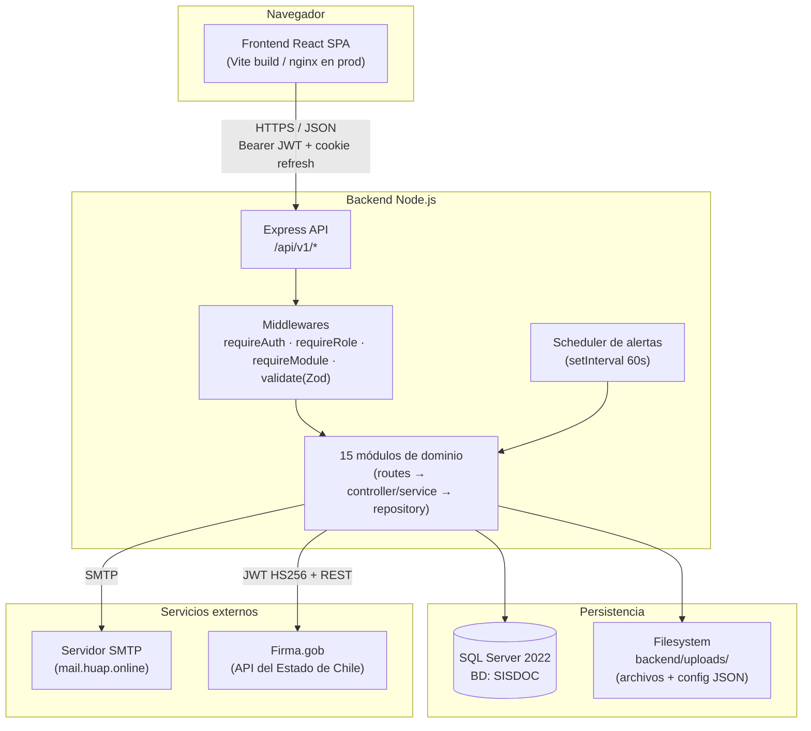
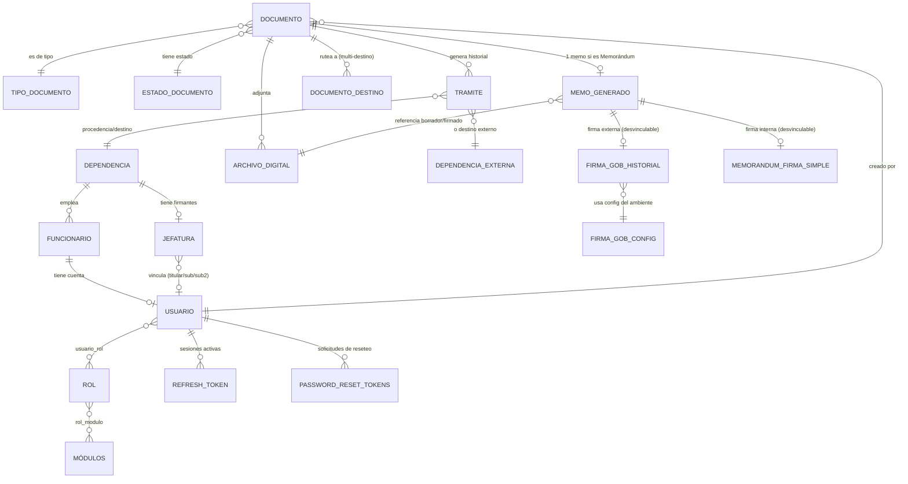
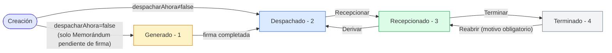
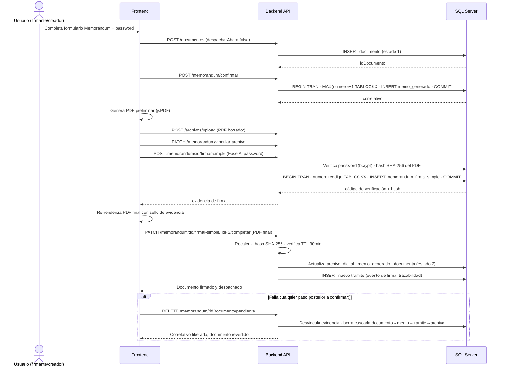
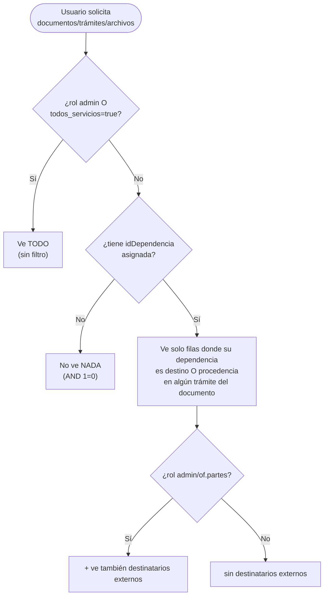
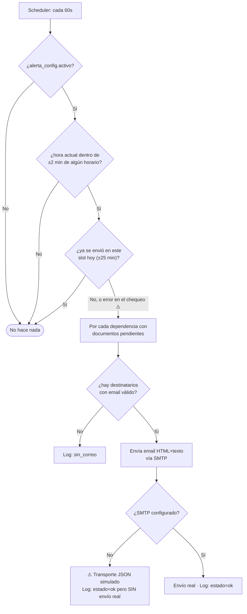

# FUNCIONALIDADES_DOC360.md
## Documentación Funcional Oficial del Sistema DOC360

**Sistema de Gestión Documental — Hospital Universitario Asociado de Puebla (HUAP)**

| Campo | Valor |
|---|---|
| Documento | Documentación funcional integral (levantamiento técnico-funcional) |
| Sistema | DOC360 (modernización de SISDOC legacy) |
| Versión de la aplicación relevada | Backend/Frontend v2.0.0 |
| Fecha de levantamiento | 2026-08-06 |
| Método | Análisis exhaustivo de código fuente (backend, frontend, base de datos, infraestructura Docker) — sin modificación de código |
| Alcance | 15 módulos backend, 25+ páginas frontend, ~45 tablas de base de datos, infraestructura Docker completa |

> **Nota de método:** este documento fue construido leyendo directamente el código fuente de producción (rutas, controladores, servicios, repositorios, esquemas de validación, componentes React, hooks, scripts SQL) — no a partir de especificaciones previas ni de la memoria de quienes desarrollaron el sistema. Cuando el código contradice la documentación previa (`CLAUDE.md`, `INFORME_AUDITORIA_DOC360.md`), se documenta lo que el código realmente hace, y se señala la discrepancia explícitamente. Las funcionalidades parcialmente implementadas, el código sin uso y las inconsistencias detectadas se marcan con el ícono ⚠️.

---

## Índice

1. [Resumen Ejecutivo](#1-resumen-ejecutivo)
2. [Arquitectura General del Sistema](#2-arquitectura-general-del-sistema)
3. [Modelo de Seguridad y Autorización (transversal)](#3-modelo-de-seguridad-y-autorización-transversal)
4. [Módulos Funcionales](#4-módulos-funcionales)
   - [4.1 Autenticación y Sesión (Login)](#41-autenticación-y-sesión-login)
   - [4.2 Recuperación de Contraseña](#42-recuperación-de-contraseña)
   - [4.3 Dashboard](#43-dashboard)
   - [4.4 Documentos](#44-documentos)
   - [4.5 Documentos Reservados](#45-documentos-reservados)
   - [4.6 Documentos Físicos y Nómina de Despacho](#46-documentos-físicos-y-nómina-de-despacho)
   - [4.7 Bandejas (Bandeja de Entrada, Enviados, Mis Trámites)](#47-bandejas-bandeja-de-entrada-enviados-mis-trámites)
   - [4.8 Trazabilidad](#48-trazabilidad)
   - [4.9 Búsqueda Global](#49-búsqueda-global)
   - [4.10 Archivos Adjuntos](#410-archivos-adjuntos)
   - [4.11 Memorándum — Correlativos y Generación](#411-memorándum--correlativos-y-generación)
   - [4.12 Firma Simple DOC360](#412-firma-simple-doc360)
   - [4.13 Firma.gob (Integración Gubernamental)](#413-firmagob-integración-gubernamental)
   - [4.14 Jefaturas y Subrogancias](#414-jefaturas-y-subrogancias)
   - [4.15 Usuarios](#415-usuarios)
   - [4.16 Roles y Módulos](#416-roles-y-módulos)
   - [4.17 Alertas](#417-alertas)
   - [4.18 Reportes](#418-reportes)
   - [4.19 Configuración del Sistema](#419-configuración-del-sistema)
   - [4.20 Auditoría](#420-auditoría)
5. [Modelo de Datos](#5-modelo-de-datos)
6. [Reglas de Negocio Consolidadas](#6-reglas-de-negocio-consolidadas)
7. [Diagramas de Flujo](#7-diagramas-de-flujo)
8. [Seguridad de la Información](#8-seguridad-de-la-información)
9. [Experiencia de Usuario (UX)](#9-experiencia-de-usuario-ux)
10. [Fortalezas del Sistema](#10-fortalezas-del-sistema)
11. [Oportunidades de Mejora](#11-oportunidades-de-mejora)
12. [Casos de Uso](#12-casos-de-uso)
13. [Glosario](#13-glosario)
14. [Anexos](#14-anexos)

---

## 1. Resumen Ejecutivo

DOC360 es la plataforma que reemplaza al sistema legacy **SISDOC** (ASP clásico sobre Windows Server 2003 / SQL Server 2005) del HUAP. Es un sistema de **gestión documental institucional**: registra, deriva, recibe, cierra y traza cada documento (oficios, resoluciones, memorándums, etc.) que circula entre los distintos servicios/dependencias del hospital, e incorpora dos mecanismos de firma electrónica para el flujo de Memorándum.

El sistema está compuesto por:

- **Backend** (Node.js 20 + TypeScript + Express + SQL Server vía `mssql` sin ORM) — 15 módulos de dominio, API REST bajo `/api/v1`.
- **Frontend** (React 18 + Vite + TailwindCSS + shadcn/ui + TanStack Query + Zustand) — 25+ páginas agrupadas en navegación "Principal" (operativa) y "Administración".
- **Base de datos** SQL Server 2022 en contenedor Docker, con ~30 tablas operacionales activas y ~25 tablas legacy heredadas del sistema ASP original sin uso por el backend moderno.

**Lo que el sistema hace hoy, en una frase:** un funcionario registra un documento (o un Memorándum institucional), lo despacha a uno o varios servicios destinatarios; cada servicio lo recepciona, puede volver a derivarlo, y finalmente lo termina; todo el recorrido queda en una traza append-only consultable por documento; el módulo de Memorándum añade numeración correlativa única por servicio/año y dos mecanismos de firma electrónica (uno interno — Firma Simple DOC360 — y uno externo — Firma.gob del Estado de Chile); un sistema de alertas por correo avisa a cada servicio de sus documentos pendientes; y todo el acceso a documentos, trámites y archivos está acotado por la dependencia (servicio) a la que pertenece cada usuario, salvo para roles con visibilidad total.

**Estado general (agosto 2026):** todos los 20 módulos funcionales listados en el índice están operativos en producción interna. Existen dos áreas marcadas explícitamente como "requiere configuración operacional" antes de su uso pleno: la firma de Memorándum (requiere jefaturas con imagen firma+timbre y usuario DOC360 vinculado) y Firma.gob (requiere credenciales del servicio externo, actualmente sin configurar). Este documento identifica además ~25 inconsistencias o piezas de código parcialmente usadas/muertas que se detallan en cada sección y se resumen en el [Anexo de hallazgos técnicos](#143-hallazgos-técnicos-consolidados).

---

## 2. Arquitectura General del Sistema

### 2.1 Stack tecnológico

| Capa | Tecnología |
|---|---|
| Backend runtime | Node.js 20 + TypeScript 5.7 |
| Framework backend | Express 4 |
| Acceso a datos | `mssql` v12.5.4 — **queries SQL directas, sin ORM** (existe una variable `DATABASE_URL` de formato Prisma en `.env` que es vestigial y no se usa) |
| Autenticación | JWT (access token 15 min) + refresh token (7 días, cookie httpOnly) |
| Contraseñas | bcrypt (12 rounds), con migración gradual desde texto plano legacy |
| Validación | Zod |
| Carga de archivos | multer (`diskStorage` para casi todo; `memoryStorage` solo en la Fase B de Firma Simple) |
| Logs | Winston + rotación diaria |
| Documentación API | Swagger/OpenAPI 3.0 en `/api-docs` (solo fuera de producción) |
| Frontend framework | React 18 + Vite 6 |
| Estilos | TailwindCSS 3 + shadcn/ui (Radix UI) — con un sistema de diseño "premium" propio superpuesto (gradientes, glassmorphism, iconos 3D) |
| Data fetching | TanStack Query v5 |
| Estado global | Zustand v5 (persistido en `localStorage`) |
| Router | React Router v6 |
| Formularios | react-hook-form + zodResolver |
| Gráficos | Recharts |
| Generación de PDF | jsPDF (100% cliente — Memorándum, Nómina) |
| Base de datos | SQL Server 2022 (contenedor Docker `sisdoc_sqlserver`) |
| Infraestructura | Docker Compose (perfil `prod` para backend + nginx; SQL Server siempre activo) |

### 2.2 Diagrama de arquitectura



### 2.3 Despliegue

- **Desarrollo:** solo `docker compose up -d sqlserver`; backend con `npm run dev` (tsx watch, puerto 3001) y frontend con `npm run dev` (Vite, puerto 5173) corriendo directamente en el host.
- **Producción (mismo host):** `docker compose --profile prod up -d --build` — levanta además los servicios `backend` (imagen `sisdoc-backend:latest`, Dockerfile multi-stage `node:20-alpine`) y `nginx` (sirve el build estático del frontend, hace proxy de `/api/` y `/api-docs` al backend, y sirve `/uploads/` directamente desde el volumen compartido sin pasar por Node).
- **Preproducción:** stack Docker Compose aislado (`docker-compose.preprod.yml`, proyecto `sisdoc_preprod`), con su propia red, contenedor SQL Server y build de frontend 100% dentro de Docker — documentado en `README_PREPROD.md`.
- Swagger UI (`/api-docs`) está **deshabilitado en producción** por diseño (`app.ts`), para no exponer el mapa de la API.
- En producción, `GET /health` devuelve únicamente `{ok:true}` (sin versión, entorno ni timestamp) para evitar *fingerprinting* del sistema.

### 2.4 Estructura de carpetas (resumen)

```
sisdoc-modernizado/
├── backend/src/{app.ts, server.ts, config/, middleware/, modules/*, shared/, types/}
├── frontend/src/{app/, components/, pages/, lib/, stores/, hooks/, styles/}
├── database/scripts/            # 17+ scripts SQL de esquema, idempotentes
├── docker-compose.yml + docker-compose.preprod.yml
└── docker/{backend,frontend,sqlserver}/
```

> ⚠️ **Discrepancia detectada:** `CLAUDE.md` documenta una regla absoluta de "nunca modificar `/legacy`" y describe esa carpeta como parte del árbol de directorios. En el repositorio actual **la carpeta `legacy/` ya no existe** — fue eliminada en el commit `136ea8c chore: eliminar legacy/ y respaldos temporales del repositorio`. El código ASP original ya no está en el repo; la documentación de referencia no se actualizó tras ese borrado.

---

## 3. Modelo de Seguridad y Autorización (transversal)

Esta sección documenta los mecanismos que se repiten, idénticos o casi idénticos, en prácticamente todos los módulos. Se referencia desde cada módulo en lugar de repetirla.

### 3.1 Autenticación (JWT + refresh)

- Login exitoso devuelve un **access token JWT** (firmado con `JWT_SECRET`, expira en 15 minutos — `env.JWT_EXPIRES_IN`, default `15m`) en el cuerpo de la respuesta, y un **refresh token** (firmado con `JWT_REFRESH_SECRET`, `env.JWT_REFRESH_EXPIRES_IN`, default `7d`) en una **cookie httpOnly** (`secure` en producción, `sameSite: strict`).
- El backend además persiste cada refresh token emitido en la tabla `refresh_token`, con expiración propia de **7 días fijos en código** (no lee `JWT_REFRESH_EXPIRES_IN`) — de modo que si se cambia esa variable de entorno, la validez real del token JWT y la validez del registro en BD podrían divergir. ⚠️
- El interceptor Axios del frontend (`lib/api/client.ts`) detecta un `401`, encola las peticiones concurrentes, dispara **un solo** `POST /auth/refresh` (usando la cookie), reintenta todas las peticiones en cola con el nuevo access token, y si el refresh también falla, limpia la sesión y redirige a `/login`.
- `POST /auth/refresh` valida el JWT **y además** verifica en BD que el token no esté revocado ni expirado — esto permite invalidar sesiones activas (p. ej. al resetear contraseña) sin esperar a que expire el JWT.
- `POST /auth/logout` revoca únicamente el refresh token de la sesión actual (no cierra otras sesiones/dispositivos del mismo usuario).
- Al cambiar la contraseña de un usuario (por auto-servicio de reseteo o por un administrador), **se revocan todos los refresh tokens activos de ese usuario**, forzando el cierre de sesión en todos los dispositivos.

### 3.2 Contraseñas: convivencia bcrypt / texto plano legacy

- La tabla `usuario` conserva la columna legacy `clave` (VARCHAR(10), texto plano) y agrega `clave_hash` (VARCHAR(255), bcrypt).
- En el login: si existe `clave_hash`, se compara con bcrypt; si no, se compara el texto plano contra `clave` (fallback legacy). Si la comparación legacy es exitosa, el sistema **migra oportunistamente** esa contraseña a bcrypt en ese mismo login (best-effort, sin bloquear el login si falla el guardado del hash).
- Al crear un usuario nuevo o cambiar su contraseña vía `/usuarios`, se guardan **ambas** columnas simultáneamente (texto plano truncado a 10 caracteres + hash bcrypt) — el texto plano se sigue escribiendo porque la columna es `NOT NULL` en el esquema legacy.
- **Límite de 10 caracteres para contraseñas** en todo el sistema (creación de usuario, cambio de contraseña, reseteo por email) — heredado del ancho de columna legacy `clave VARCHAR(10)`. Existe un `TODO` explícito en el código para ampliarlo cuando se elimine esa columna. ⚠️ Ver también §11.
- Regla de complejidad exigida al crear/editar usuarios: **8–10 caracteres, al menos una mayúscula y un dígito** (regex `^(?=.*[A-Z])(?=.*\d)`). El login en sí no re-valida complejidad (solo exige campos no vacíos).

### 3.3 Autorización: roles, módulos y visibilidad por servicio

Tres capas independientes de control de acceso, todas aplicadas en el backend (el frontend además las refleja en la UI, pero **no** son la fuente de verdad — el backend debe reforzarlas en cada endpoint):

1. **Rol** (`requireRole('admin', 'of.partes', ...)`) — gatilla acciones específicas (ej. eliminar documento = solo admin).
2. **Módulo** (`requireModule('usuarios')`) — gatilla el acceso a una sección completa del menú; el rol `admin` bypasea siempre esta capa.
3. **Visibilidad por servicio** (patrón `hasFullAccess` + filtro `EXISTS` sobre `tramite`) — determina, dentro de un módulo al que el usuario sí tiene acceso, **qué filas** puede ver.

**Patrón `hasFullAccess(user)`** (repetido verbatim en `documentos`, `tramites`, `busqueda`, `reportes`, `archivos`):
```
hasFullAccess(user) = user.roles.includes('admin') || user.todosServicios === true
```
Si es `true`, el usuario ve todo. Si es `false`, se aplica un filtro `EXISTS` sobre la tabla `tramite` que solo deja pasar documentos/trámites/archivos donde la dependencia del usuario (`user.idDependencia`) aparece como **destino o procedencia** en algún trámite de ese documento (más una condición adicional para ver destinatarios externos, reservada a `admin`/`of.partes`). Un usuario **sin dependencia asignada y sin acceso total no ve nada** (`AND 1=0`).

**`todos_servicios` (bypass total) — diseño fail-closed:**
- Default `false` a tres niveles: constraint `DEFAULT` de la columna en BD (corregido en `17-todos-servicios-fail-closed.sql`, antes era `1`), valor por defecto al crear un usuario vía API, y claim del JWT (`payload.todosServicios ?? false` — un token sin ese claim nunca se interpreta como acceso total).
- Solo el rol `admin` puede otorgarlo o revocarlo (`POST/PATCH /usuarios`).

**Roles reales del sistema** (tabla `rol`, editable dinámicamente, pero con 4 roles operativos consolidados en el código):
- **`admin`** — bypass total de módulos, de visibilidad por servicio, único rol que puede gestionar otros administradores, asignar `todos_servicios`, vincular usuarios a slots de firmante (Jefaturas), y eliminar documentos.
- **`of.partes`** (Oficina de Partes; nombre legado `coordinador`, renombrado por script) — ve documentos con destinatario externo, crea documentos físicos/reservados, gestiona el catálogo de dependencias y tipos de documento junto con `admin`, gestiona firmantes de Memorándum y Jefaturas (salvo el paso de vincular usuario, exclusivo de `admin`), ve el KPI de "reservados".
- **`funcionario`** — rol base/por defecto; solo opera documentos de su propio servicio.
- **`supervisores`** — puede derivar y reabrir documentos con los mismos privilegios que `of.partes` en el flujo documental, pero sin los privilegios exclusivos de Oficina de Partes (gestión de catálogos, físicos, reservados). No tiene lógica especial hardcodeada más allá de las listas de roles permitidos en cada endpoint — es un rol configurado como cualquier otro vía el módulo Roles.

### 3.4 Protecciones de plataforma (Express)

- **CORS**: lista blanca explícita desde `CORS_ORIGIN` (coincidencia por prefijo, no exacta ⚠️); peticiones sin cabecera `Origin` (server-to-server) siempre se permiten.
- **Helmet**: CSP deshabilitada globalmente (API JSON pura) pero aplicada selectivamente a `/health` y `/api-docs`.
- **Rate limiting**: `/api/v1/auth/*` limitado a 20 peticiones/15min en producción (100 en desarrollo); `forgot-password` limitado aparte a 5/15min; `reset-password` a 10/15min.
- **Validación de entrada**: Zod en el borde de cada endpoint (`validate(schema)` middleware) — sobreescribe `req.body/query/params` con el valor ya parseado/transformado.
- **Manejo de errores centralizado**: convención `{statusCode, message}` lanzada como objeto literal desde los servicios, capturada por `errorHandler`; detalles de stack solo se filtran en `development`.
- **Ruta estática de archivos** (`GET /uploads/:filename`) protegida con `path.basename()` contra *path traversal*, pero solo exige sesión válida (`requireAuth`), **no** verifica pertenencia al servicio — ver detalle de la inconsistencia en §4.10.

---

## 4. Módulos Funcionales

### 4.1 Autenticación y Sesión (Login)

**Objetivo:** identificar de forma segura a cada usuario y establecer una sesión (access + refresh token) que habilite el resto del sistema según su rol y servicio.

**Descripción:** pantalla pública de login con branding institucional configurable (logo, fondo, textos — ver §4.19), formulario usuario/clave, recuperación de contraseña por email, y renovación automática de sesión transparente para el usuario mientras usa la aplicación.

**Usuarios que la utilizan:** todos — es la puerta de entrada obligatoria; no hay acceso anónimo a ningún módulo salvo el propio login y la recuperación de contraseña.

**Reglas de negocio:**
- Usuario (máx. 10 caracteres) + contraseña (texto plano en tránsito, sobre HTTPS) → 401 genérico "Credenciales inválidas" tanto si el usuario no existe como si la contraseña es incorrecta (no distingue el motivo hacia el cliente, sí en el log de auditoría interno).
- Ver §3.2 para la convivencia bcrypt/texto plano.
- Tras un login exitoso se recalculan `roles` y `módulos` frescos desde BD (no se cachean en el JWT indefinidamente — cada refresh también los recalcula, de modo que un cambio de rol se aplica a más tardar en el siguiente refresh, sin necesidad de recargar sesión).

**Flujo:**
1. Usuario ingresa credenciales → `POST /auth/login`.
2. Backend valida, emite `accessToken` (body) + `refreshToken` (cookie httpOnly).
3. Frontend guarda `user` + `accessToken` en el store Zustand (persistido en `localStorage`).
4. Cada petición subsiguiente adjunta `Authorization: Bearer <accessToken>`.
5. Al recibir un 401, el interceptor Axios solicita `POST /auth/refresh` automáticamente y reintenta la petición original — transparente para el usuario mientras el refresh token siga vigente y no revocado.
6. Si el refresh también falla, se limpia la sesión y se redirige a `/login`.

**Entradas:** `usuario` (string), `clave` (string).
**Salidas:** objeto `user` (perfil + roles + módulos + dependencia), `accessToken`, `expiresIn`.
**Validaciones:** Zod (`usuario` 1–50 chars, `clave` 1–100 chars) — sin regla de complejidad en el login mismo.
**Dependencias:** tablas `usuario`, `funcionario`, `dependencia`, `usuario_rol`/`rol`/`rol_modulo`, `refresh_token`.
**Restricciones:** rate limit 20 intentos/15 min en producción por IP (compartido con todo `/api/v1/auth/*`).
**Archivos involucrados:** `backend/src/modules/auth/{auth.routes,auth.controller,auth.service,auth.schema}.ts`, `frontend/src/pages/auth/LoginPage.tsx`, `frontend/src/lib/api/auth.api.ts`, `frontend/src/lib/api/client.ts`, `frontend/src/stores/auth.store.ts`.
**APIs:** `POST /auth/login`, `POST /auth/refresh`, `POST /auth/logout`, `GET /auth/me`.
**Tablas:** `usuario`, `funcionario`, `dependencia`, `usuario_rol`, `rol`, `rol_modulo`, `refresh_token`, `auditoria`.
**Componentes React:** `LoginPage.tsx`, `ProtectedRoute.tsx`, `stores/auth.store.ts`.
**Riesgos:**
- ⚠️ Contraseñas legacy en texto plano siguen siendo válidas hasta el primer login exitoso post-migración.
- ⚠️ `expiresIn: 900` (15 min) está *hardcodeado* en la respuesta de login/refresh en vez de derivarse de `env.JWT_EXPIRES_IN` — si se cambia esa variable de entorno sin tocar el código, la respuesta reportará una duración incorrecta al cliente.
**Observaciones:** el mensaje de error genérico ante credenciales inválidas es una buena práctica de seguridad (no revela si el usuario existe).

---

### 4.2 Recuperación de Contraseña

**Objetivo:** permitir a un usuario recuperar acceso sin intervención de un administrador, mediante un enlace de un solo uso enviado por correo.

**Descripción:** flujo de 3 pantallas — solicitar enlace, validar token, definir nueva contraseña — con mensajes deliberadamente genéricos para no revelar si un correo existe en el sistema.

**Usuarios que la utilizan:** cualquier usuario **con email configurado** en su ficha (`usuario.email`). Los usuarios legacy que nunca recibieron un email en su migración no pueden usar esta vía y requieren intervención de un administrador.

**Reglas de negocio:**
1. `POST /auth/forgot-password { email }` — siempre responde el mismo mensaje genérico ("si el correo existe, recibirás un enlace"), exista o no el email, para evitar enumeración de usuarios.
2. Si el email existe: invalida todos los tokens de reseteo previos aún no usados de ese usuario, genera un token aleatorio de 32 bytes, almacena **solo el hash SHA-256** del token (nunca el token en claro) en `password_reset_tokens`, con expiración configurable (`RESET_TOKEN_EXPIRES_MINUTES`, default 30 min).
3. El enlace enviado es `FRONTEND_URL/reset-password?token=<token-crudo>`.
4. `GET /auth/validate-reset-token?token=` permite al frontend verificar validez antes de mostrar el formulario de nueva contraseña.
5. `POST /auth/reset-password { token, nuevaClave }` — valida el token (hash + no usado + no vencido), actualiza `clave_hash` (bcrypt), marca el token usado, invalida los demás tokens activos del usuario, y **revoca todos los refresh tokens activos** (cierra sesión en todos los dispositivos).
6. Toda la operación queda auditada en `auditoria_reset` (eventos: email no encontrado, correo enviado/fallido, token inválido, contraseña cambiada), incluyendo IP y user-agent.

**Entradas:** email (solicitud); token + nueva contraseña (confirmación).
**Salidas:** mensajes de confirmación genéricos; email HTML+texto con el enlace.
**Validaciones:** email válido, máx. 100 chars; `nuevaClave` 4–10 caracteres (⚠️ tope de 10 heredado, ver §3.2 y §11); confirmación de contraseña coincidente (solo en frontend).
**Dependencias:** servicio SMTP configurado (ver riesgo abajo); tablas `usuario`, `password_reset_tokens`, `auditoria_reset`, `refresh_token`.
**Restricciones:** rate limit propio — 5 solicitudes/15min (prod) para `forgot-password`, 10/15min para `reset-password`.
**Archivos involucrados:** `backend/src/modules/auth/password-reset.routes.ts`, `backend/src/shared/services/email.service.ts`, `frontend/src/pages/auth/{ForgotPasswordPage,ResetPasswordPage}.tsx`.
**APIs:** `POST /auth/forgot-password`, `GET /auth/validate-reset-token`, `POST /auth/reset-password`.
**Tablas:** `usuario`, `password_reset_tokens`, `auditoria_reset`, `refresh_token`.
**Componentes React:** `ForgotPasswordPage.tsx`, `ResetPasswordPage.tsx` (indicador de fuerza de contraseña de 3 segmentos, cuenta regresiva de redirección tras éxito).
**Riesgos:**
- ⚠️ **Si SMTP no está configurado** (`SMTP_HOST`/`SMTP_USER` vacíos), el sistema cae a un transporte "JSON" que no envía nada real, pero **no lanza excepción** — la operación se registra como exitosa en el log/auditoría aunque el usuario nunca reciba el correo. El arranque del servidor solo emite una advertencia en consola si `NODE_ENV=production` sin SMTP, no bloquea el arranque.
- ⚠️ Usuarios sin `email` en su ficha (varios usuarios legacy) no pueden autorecuperar su contraseña — deben ser atendidos por un administrador vía `/admin/usuarios`.
**Observaciones:** el diseño de "no revelar si el correo existe" y "hashear el token en BD" siguen buenas prácticas OWASP para recuperación de contraseña.

---

### 4.3 Dashboard

**Objetivo:** dar una vista ejecutiva instantánea del estado documental del hospital (o del propio servicio, según permisos) al iniciar sesión.

**Descripción:** página de inicio con saludo contextual, indicadores clave (KPI), gráficos de evolución y distribución, un widget de "semáforo ejecutivo", un pipeline visual del flujo documental y un listado de actividad reciente.

**Usuarios que la utilizan:** todos los usuarios con el módulo `dashboard` habilitado (por defecto, todos los roles).

**Reglas de negocio:**
- Si el usuario no tiene acceso total (§3.3), todos los indicadores se acotan a su propio servicio (`user.idDependencia`).
- El indicador "Reservados" solo es visible para `admin`/`of.partes` (`canSeeReservados`) — para el resto de los usuarios el backend devuelve `null` explícitamente en ese campo, no un valor filtrado.
- Solo los usuarios con acceso total ven los contadores globales de "archivos" y "usuarios" (para usuarios acotados a un servicio, ambos quedan en 0).
- El "semáforo ejecutivo" es puramente un cálculo **del lado del cliente** a partir de la proporción urgentes/pendientes (>15% o >20 urgentes = crítico; >5% u 8 urgentes = atención; si no, normal) — no es un dato que devuelva el backend.

**Flujo:** al montar la página se disparan en paralelo `GET /reportes/dashboard` (refresco cada 120s) y `GET /reportes/actividad-reciente` (refresco cada 30s).

**Entradas:** ninguna (solo la sesión del usuario determina el alcance).
**Salidas:** `totales` (total, pendientes, urgentes, cerradosHoy, creadosHoy, tramites, reservados|null, archivos, usuarios), `porEstado[]`, `porMes[]` (últimos 6 meses), `porTipo[]` (top 8), `servicio` (id de dependencia mostrado, o `null` si es vista global), lista de actividad reciente (últimos 15 movimientos con acción sintética INGRESADO/DESPACHADO/RECEPCIONADO/DERIVADO/CERRADO).
**Validaciones:** ninguna de entrada (solo lectura).
**Dependencias:** módulo Reportes (comparte el mismo endpoint de backend).
**Restricciones:** requiere módulo `dashboard`.
**Archivos involucrados:** `backend/src/modules/reportes/reportes.routes.ts`, `frontend/src/pages/dashboard/DashboardPage.tsx`, `frontend/src/lib/api/reportes.api.ts`.
**APIs:** `GET /reportes/dashboard`, `GET /reportes/actividad-reciente`.
**Tablas:** `documento`, `tramite`, `estado_documento`, `tipo_documento`, `archivo_digital`, `usuario`.
**Componentes React:** `DashboardPage.tsx` (con sub-componentes internos `DashboardKpiCard`, `PipelineStage`, `SemaforoEjecutivo`, gráficos Recharts `AreaChart`/`PieChart`).
**Riesgos:** ninguno crítico — es un módulo de solo lectura.
**Observaciones:** el pipeline visual (Despachados → Recepcionados → En Proceso → Terminados) agrupa estados de trámite, no de documento, lo que ofrece una vista más granular del embudo operativo que el estado simple del documento.

---

### 4.4 Documentos

**Objetivo:** registrar, consultar y hacer avanzar (despachar / recepcionar / derivar / terminar / reabrir) cada documento institucional a lo largo de su ciclo de vida.

**Descripción:** es el módulo central del sistema. Cubre creación (con soporte para adjuntos múltiples y, opcionalmente, ruteo a varios destinos simultáneos), listado paginado con búsqueda, detalle con historial completo, y las siete transiciones de estado que constituyen el flujo documental.

**Usuarios que la utilizan:** todos los roles con el módulo `documentos`; las acciones de transición están además graduadas por rol (ver tabla de permisos abajo).

#### 4.4.1 Estados

**Estado del documento** (`documento.id_estado_documento`):
| Código | Nombre | Significado |
|---|---|---|
| 1 | Generado | Documento creado pero aún no despachado (usado exclusivamente en el flujo de Memorándum pendiente de firma) |
| 2 | Despachado | Enviado a su(s) destino(s), a la espera de recepción |
| 3 | Recepcionado | El destino confirmó la recepción |
| 4 | Terminado | Cerrado — fin del ciclo (reabrible) |

**Estado del trámite** (`tramite.id_estado_tramite`, un valor por cada movimiento en la traza, no del documento):
| Código | Nombre |
|---|---|
| 1 | Generado |
| 2 | Despachado |
| 3 | Recepcionado |
| 4 | Derivado |
| 5 | Cerrado / Terminado |
| 6 | (variante de cierre alterna, usada solo en el chequeo "todos los destinos cerrados" del ruteo multi-destino) |
| 7 | Archivo adjuntado (evento de traza *no* transicional, generado automáticamente al subir un archivo a un documento) |

#### 4.4.2 Matriz de permisos por acción

| Acción | Roles habilitados | Estado requerido |
|---|---|---|
| Crear documento | todos con módulo `documentos` | — |
| Crear documento físico / reservado | solo `admin`, `of.partes` | — |
| Crear con destinatario externo | solo `admin`, `of.partes` | — |
| Despachar / redespachar | `admin`, `of.partes`, `supervisores`, `funcionario` | Generado (1) o Recepcionado (3) |
| Recepcionar | `admin`, `of.partes`, `supervisores`, `funcionario` | Despachado (2) |
| Derivar | `admin`, `of.partes`, `supervisores` (excluye `funcionario`) | Recepcionado (3) |
| Terminar | `admin`, `of.partes`, `supervisores`, `funcionario` | Recepcionado (3) únicamente |
| Reabrir | `admin`, `supervisores` (excluye `of.partes` y `funcionario`) | Terminado (4) |
| Eliminar documento | solo `admin` | — |

#### 4.4.3 Reglas de negocio (creación)

- El `id_procedencia` de un documento nuevo siempre se fuerza a la dependencia del usuario que lo crea — el frontend no puede suplantar la procedencia.
- **Numeración interna**: `num_interno` y `num_oficial` se calculan como `MAX(...)+1` sobre **toda la tabla `documento`** (no por año ni por tipo), dentro de un único batch T-SQL con hints `UPDLOCK, HOLDLOCK` para evitar condiciones de carrera entre inserciones concurrentes. No son secuencias per-año/tipo — vale la pena confirmar con el negocio si eso coincide con la expectativa de "folio".
- **Multi-destino**: si se envían 2 o más `destinos[]`, se crea un registro `documento_destino` por cada uno, cada cual con su propio ciclo recepcionar/terminar independiente; el documento se marca Terminado (4) recién cuando **todos** los destinos activos están cerrados.
- Las observaciones se enriquecen automáticamente con prefijos de trazabilidad legibles por máquina: `[SOPORTE:FISICO]`, `[RESERVADO->DIRECCION]`, `[PENDIENTE:FIRMA]`.
- Si `tipoSoporte='F'` (físico) el sistema genera automáticamente una **Nómina de despacho** en PDF (ver §4.6).
- Si `reservado=true`, el destino se fuerza a la dependencia "Dirección" (id fijo 32) — ver §4.5.
- Si `despacharAhora=false` (usado exclusivamente por el flujo de Memorándum + firma), el documento queda en estado 1 (Generado) sin despachar hasta que la firma se complete.

#### 4.4.4 Reglas de negocio (transiciones)

- **Despachar**: rechaza si el documento ya está Terminado (4). Cada despacho/redespacho agrega una **fila nueva** de trámite (patrón *append-only*, nunca se sobrescribe historial), encadenando la procedencia del nuevo trámite al destino del trámite anterior.
- **Recepcionar**: inserta un trámite nuevo (estado 3) y actualiza `documento.id_estado_documento=3` de forma atómica (transacción SQL única).
- **Derivar**: inserta un trámite nuevo (estado 4 = Derivado) pero **revierte el documento a estado 2 (Despachado)**, no lo deja en 4 — Derivado es un marcador transitorio a nivel de trámite, para que el nuevo destinatario pueda recepcionar/despachar normalmente.
- **Terminar**: solo permitido desde estado Recepcionado (3) — **no** se puede terminar directamente desde Despachado (2). Inserta trámite estado 5 + documento a estado 4.
- **Reabrir**: solo desde Terminado (4); exige un motivo obligatorio (usado como observación); inserta un trámite nuevo estado 3 (Recepcionado) — el historial previo permanece intacto, no se borra ni edita.
- **Control de acceso de transición**: todas las transiciones, además del chequeo de rol, verifican que el usuario tenga acceso al documento (misma condición `EXISTS` de §3.3) — esta verificación fue añadida en la auditoría de julio 2026; antes solo se validaba rol+estado, permitiendo que cualquier usuario con el rol adecuado operara documentos de servicios ajenos.

#### 4.4.5 Eliminación (solo `admin`)

Pese a llamarse `softDelete()` en el código, es en realidad un **borrado físico** con respaldo previo, ejecutado íntegramente dentro de **una sola transacción SQL**:
1. Respaldo best-effort a `respaldo_documento` (si falla, se continúa igual — no bloquea el borrado).
2. Desvincula (pone en `NULL`, no borra) las referencias en `firma_gob_historial` y `memorandum_firma_simple` para preservar la evidencia de auditoría de firmas aunque el documento desaparezca.
3. Borra en cascada, en orden: `memo_generado` → `archivo_digital` → `tramite` → `documento_destino` → `documento`.

**Entradas (creación):** `materia`, `idTipoDocumento`, `fechaDocumento`, `observaciones`, `tipoDestinatario` (D/E), `idDestino` o `destinos[]` (hasta 20), `idTipoDistribucion`, `idTipoCompromiso`, `idEstadoCompromiso`, `diasCompromiso`, `tipoSoporte` (D/F), `reservado`.
**Salidas:** objeto documento completo mapeado (ver estructura de respuesta en §4.4.6).
**Validaciones:** todas Zod — ver tabla completa en el código fuente citado; `materia` máx. 250 chars (mínimo 5 chars validado solo en frontend, no en el schema backend ⚠️), `observaciones` máx. 500.
**Dependencias:** catálogos `tipo_documento`, `dependencia`, `tipo_distribucion`, `tipo_compromiso`, `estado_compromiso`; módulo Archivos para adjuntos; módulo Memorándum si es tipo "Memorándum".
**Restricciones:** ver matriz de permisos §4.4.2; visibilidad acotada por servicio (§3.3).
**Archivos involucrados:** `backend/src/modules/documentos/{documento.routes,documento.controller,documento.service,documento.repository,documento.schema}.ts`, `frontend/src/pages/documentos/{DocumentosPage,DocumentoDetallePage,NuevoDocumentoPage}.tsx`, `frontend/src/components/documentos/{DespacharModal,AdjuntarArchivoModal}.tsx`.
**APIs:** `GET /documentos`, `GET /documentos/buscar-por-numero`, `GET /documentos/:id`, `GET /documentos/:id/{historial,trazabilidad,destinos}`, `POST /documentos`, `POST /documentos/:id/{despachar,recepcionar,derivar,terminar,reabrir,recepcionar-destino,terminar-destino}`, `DELETE /documentos/:id`.
**Tablas:** `documento`, `tramite`, `documento_destino`, `tipo_documento`, `estado_documento`, `dependencia`, `dependencia_externa`, `usuario`, `funcionario`, `memo_generado`, `archivo_digital`, `respaldo_documento`, `firma_gob_historial`, `memorandum_firma_simple`.
**Componentes React:** `DocumentosPage.tsx` (listado), `NuevoDocumentoPage.tsx` (1218 líneas — el formulario más grande del sistema), `DocumentoDetallePage.tsx` (882 líneas), `DespacharModal.tsx`, `AdjuntarArchivoModal.tsx`.

#### 4.4.6 Mapeo de respuesta (`mapDocumento`)

⚠️ Varios campos del objeto documento que expone la API **siempre** vienen `null`, pese a estar declarados en la forma de respuesta: `prioridad` (id/descripción/color — la funcionalidad de prioridad no está realmente conectada en este módulo, solo existe como catálogo hardcodeado, ver §4.18), `destino`/`procedencia` a nivel de documento (solo se resuelven vía `tramiteActual`/trazabilidad, no en la fila base), `fechaCierre`, `observacion` (a nivel raíz). El frontend maneja esto defensivamente (`safeStr()` en `DocumentoDetallePage.tsx`) para no romper si la forma cambia.

**Riesgos:**
- ⚠️ Existen **dos** caminos de código que aparentan resolver "recibir" y "cerrar" un trámite: uno en el módulo Documentos (`recepcionar`/`terminar`, que inserta filas nuevas y sincroniza `documento.id_estado_documento`) y otro en el módulo Trámites (`recibir`/`cerrar`, que **muta la fila existente** y **no** toca el estado del documento). Ambos están vivos y son alcanzables desde pantallas distintas del frontend (detalle de documento vs. Bandeja de entrada) — ver detalle en §4.7.
- El `buscarPorNumero` filtra fila por fila en JavaScript tras la consulta (no en SQL) para aplicar el control de acceso por servicio — funcionalmente correcto pero menos eficiente que un filtro en la propia query.
- La bandera `reservado` solo restringe la **creación** (quién puede marcarla, y fuerza el destino); una vez creado el documento, las reglas de acceso son las mismas `EXISTS` de cualquier otro documento — no hay una capa de protección adicional después de creado.

**Observaciones:** el patrón *append-only* de trámites (nunca se edita/borra un movimiento histórico, solo se agregan nuevos) es una decisión de diseño sólida para trazabilidad y auditoría — se mantiene consistentemente en todas las transiciones.

---

### 4.5 Documentos Reservados

**Objetivo:** permitir a Oficina de Partes registrar documentos de circulación restringida, visibles/operables únicamente por la Dirección del hospital.

**Descripción:** no es un módulo separado en el código — es una bandera (`reservado: boolean`) dentro del flujo de creación de Documentos, exclusiva de `admin`/`of.partes`.

**Usuarios que la utilizan:** creación exclusiva de `admin`/`of.partes`; consulta gobernada por las mismas reglas de acceso por servicio que cualquier documento (la dependencia forzada es "Dirección", id 32).

**Reglas de negocio:**
- Al marcar `reservado=true`, el frontend fuerza y bloquea la selección de destino a la dependencia "Dirección" (id hardcodeado 32) — no editable por el usuario.
- El campo legado `documento.resuelto` (`'S'`/`NULL`) se reutiliza como el indicador de "reservado" a nivel de base de datos — no existe una columna dedicada.
- La observación se prefija automáticamente con `[RESERVADO->DIRECCION]`.
- El KPI de conteo de "reservados" en Dashboard/Reportes solo se expone a `admin`/`of.partes` (`canSeeReservados`); para el resto de roles el valor viaja como `null`, no como un número filtrado o cero.
- **No existe una restricción de acceso adicional post-creación**: una vez creado, un documento reservado sigue las mismas reglas `EXISTS` de visibilidad por servicio que cualquier otro documento — solo quienes tengan acceso a la dependencia "Dirección" (o acceso total) pueden verlo/operarlo, lo cual en la práctica lo restringe adecuadamente, pero no hay una segunda capa de protección ligada específicamente a la bandera `reservado`.
- En Memorándum, si el documento es reservado, se omite el selector de destinatario específico (persona) — el memo reservado va dirigido genéricamente a Dirección.

**Entradas:** bandera `reservado` (booleana) en el formulario de creación.
**Salidas:** el documento se comporta igual que cualquier otro, con el destino forzado.
**Validaciones:** solo `admin`/`of.partes` puede enviar `reservado=true` (403 en caso contrario).
**Dependencias:** dependencia "Dirección" (id 32) debe existir en el catálogo.
**Restricciones:** creación exclusiva de `admin`/`of.partes`.
**Archivos involucrados:** `backend/src/modules/documentos/{documento.controller,documento.service,documento.schema}.ts`, `frontend/src/pages/documentos/NuevoDocumentoPage.tsx` (Sección 0), `frontend/src/hooks/useRole.ts` (`puedeVerReservados`).
**APIs:** las mismas de Documentos (`POST /documentos` con `reservado:true`).
**Tablas:** `documento` (columna `resuelto` reutilizada), `dependencia`.
**Componentes React:** `NuevoDocumentoPage.tsx` (banner de bloqueo de destino), `DocumentosPage.tsx`/`DocumentoDetallePage.tsx` (badge "Reservado" con ícono de candado).
**Riesgos:** ⚠️ el ID de la dependencia "Dirección" está *hardcodeado* (32) tanto en frontend como backend — si esa dependencia cambiara de id en una reorganización de catálogo, la funcionalidad se rompería silenciosamente.
**Observaciones:** el nombre "Reservado" puede sugerir un control de confidencialidad más fuerte del que realmente existe (es un enrutamiento forzado + una bandera visual, no cifrado ni un ACL adicional).

---

### 4.6 Documentos Físicos y Nómina de Despacho

**Objetivo:** dar soporte al flujo de documentos en papel (no completamente digitalizados) que igual deben quedar registrados y trazados en el sistema, generando una "Nómina" imprimible que acompaña físicamente al documento.

**Descripción:** al crear un documento con `tipoSoporte='F'` (físico), el sistema genera automáticamente, 100% en el cliente (jsPDF), un PDF de "Nómina de despacho" — una hoja de ruta administrativa que lista destino(s), materia, tipo y fechas, para adjuntar al papel físico.

**Usuarios que la utilizan:** exclusivo de `admin`/`of.partes` (mismo gate que documentos reservados).

**Reglas de negocio:**
- `tipoSoporte='F'` se almacena en `documento.medio`.
- La observación se prefija con `[SOPORTE:FISICO]`.
- Tras crear exitosamente un documento físico, el frontend obtiene `GET /documentos/:id/destinos`, arma el objeto de datos de la Nómina y abre el modal correspondiente automáticamente — no requiere una acción manual adicional del usuario.
- La Nómina puede volver a abrirse en cualquier momento desde el detalle del documento (botón visible solo si `tipoSoporte==='F'`).
- El PDF incluye un logo institucional convertido a JPEG RGB (sin canal alfa) para evitar errores de render de jsPDF, con marca de agua del logo al 7% de opacidad.
- No lleva ninguna lógica de firma — es un manifiesto de despacho interno, no un documento firmado.

**Entradas:** los mismos datos del documento físico ya creado + lista de destinos.
**Salidas:** PDF descargable/imprimible (`window.print()` sobre el PDF abierto en una nueva pestaña).
**Validaciones:** ninguna adicional (hereda las de creación de documento).
**Dependencias:** logo institucional configurado (con fallback a un asset estático `/logo-huap.png` si `GET /configuracion` falla).
**Restricciones:** creación exclusiva `admin`/`of.partes`.
**Archivos involucrados:** `frontend/src/components/documentos/NominaModal.tsx`, `frontend/src/lib/utils/nomina.generator.ts`, `frontend/src/lib/config/branding.ts`.
**APIs:** `GET /documentos/:id/destinos`, `GET /configuracion` (para el logo).
**Tablas:** `documento`, `documento_destino`, `dependencia`.
**Componentes React:** `NominaModal.tsx`.
**Riesgos:** ninguno crítico — es una funcionalidad autocontenida en el cliente.
**Observaciones:** al ser generada 100% en el navegador, no queda un registro server-side de la Nómina como archivo adjunto — solo existe como impresión/descarga puntual, regenerable en cualquier momento a partir de los datos vivos del documento.

---

### 4.7 Bandejas (Bandeja de Entrada, Enviados, Mis Trámites)

**Objetivo:** dar vistas operativas del día a día — qué me llegó, qué envié, qué tengo pendiente de gestionar.

**Descripción:** tres pantallas alimentadas por el mismo módulo backend `tramites`, cada una con una perspectiva distinta sobre la misma tabla `tramite`.

#### 4.7.1 Bandeja de Entrada (`/bandeja`)

- Muestra **un renglón por documento** (no por trámite) — usa una CTE que selecciona, por documento, el trámite más reciente que cumple el filtro, evitando duplicados cuando un documento pasó por varios servicios.
- Para usuarios sin acceso total: solo documentos donde su dependencia es el **destino** (`tipo_destinatario='D'`, más `'E'` si puede ver externos).
- Filtros por pastillas: Todos / Por recibir (2) / Recepcionados (3) / Cerrados (5).
- Acción "Recibir" (solo sobre trámites en estado 2): `PATCH /tramites/:id/recibir` — **muta directamente** la fila de trámite existente (estado→3, fecha/usuario de recepción) y **no** actualiza `documento.id_estado_documento`.
- Badge de pendientes en el Sidebar: consulta en segundo plano (`refetchInterval` 60s) `GET /tramites?idEstado=2&porPagina=1` para mostrar el conteo total sin cargar la lista completa.
- Las tarjetas KPI de la cabecera (Total/Por recibir/Recepcionados/Cerrados) se calculan **solo sobre la página actual** de resultados, excepto "Total" que sí usa el total global — inconsistencia menor de UX (ver §11).

#### 4.7.2 Enviados (`/enviados`)

- Espejo de la Bandeja pero para documentos donde la dependencia del usuario **fue procedencia** en algún momento (`GET /tramites/enviados`).
- Solo lectura — sin acciones por fila, sin pastillas de filtro.
- ⚠️ Para usuarios con acceso total, "Enviados" no filtra por origen en absoluto (mismo comportamiento que la Bandeja global) — un administrador vería listas idénticas en ambas pantallas.

#### 4.7.3 Mis Trámites (`/tramites`)

- Vista genérica de todos los trámites accesibles al usuario, con dos acciones: **Recibir** (estado 1) y **Cerrar** (estado 2) — nótese que usa una numeración de estados *distinta* en su UI (1 Pendiente / 2 En proceso / 3 Completado / 4 Rechazado) a la que usa Bandeja — es la misma acción de backend `PATCH /tramites/:id/{recibir,cerrar}` presentada con otra semántica de etiquetas en pantalla.
- `PATCH /tramites/:id/cerrar` (estado→5) tampoco valida el estado actual del trámite antes de cerrar (no hay guarda contra cerrar dos veces o cerrar algo no recibido) ni sincroniza `documento.id_estado_documento`.

**Entradas:** filtros de estado, paginación.
**Salidas:** listados paginados con columnas de materia, tipo, estado, procedencia/destino resueltos, fecha, observaciones.
**Validaciones:** `pagina`/`porPagina` (tope 50).
**Dependencias:** visibilidad por servicio (§3.3).
**Restricciones:** requiere módulos `bandeja`/`enviados`/`tramites` respectivamente.
**Archivos involucrados:** `backend/src/modules/tramites/tramite.routes.ts` (único archivo — sin controller/service/repository separados, a diferencia del resto del sistema), `frontend/src/pages/{bandeja/BandejaPage,enviados/EnviadosPage,tramites/TramitesPage}.tsx`.
**APIs:** `GET /tramites`, `GET /tramites/enviados`, `PATCH /tramites/:id/recibir`, `PATCH /tramites/:id/cerrar`.
**Tablas:** `tramite`, `documento`, `tipo_documento`, `estado_tramite`, `dependencia`, `dependencia_externa`.
**Componentes React:** `BandejaPage.tsx`, `EnviadosPage.tsx`, `TramitesPage.tsx`, `EmptyState.tsx`.

**Riesgos:**
- ⚠️ **Inconsistencia de integridad más relevante del sistema**: las acciones "Recibir"/"Cerrar" de este módulo y las acciones "Recepcionar"/"Terminar" del módulo Documentos operan sobre el mismo dominio de datos con semánticas distintas (mutación en sitio vs. inserción append-only + sincronización de estado del documento). Un documento podría quedar con su trámite marcado "Recibido" (vía Bandeja) sin que `documento.id_estado_documento` lo refleje, generando una lectura distinta según qué pantalla se consulte.
- El módulo `tramites` concentra rutas, control de acceso y SQL en un único archivo de 250 líneas, sin la separación en capas (controller/service/repository) que sí tiene `documentos` — no es un riesgo funcional, pero sí de mantenibilidad.

---

### 4.8 Trazabilidad

**Objetivo:** reconstruir, para cualquier documento, la línea de tiempo completa de todos sus movimientos (despachos, recepciones, derivaciones, cierres, reaperturas, adjuntos, firmas) en un único lugar consultable.

**Descripción:** vista de búsqueda (por número exacto o texto libre) que abre una línea de tiempo vertical con cada evento de trámite, incluyendo, desde la corrección de julio 2026, los eventos de firma electrónica (antes invisibles porque se sobrescribía el trámite en sitio en vez de insertar una fila nueva).

**Usuarios que la utilizan:** todos los roles con módulo `trazabilidad`; el contenido mostrado está acotado por la visibilidad por servicio del documento consultado.

**Reglas de negocio:**
- Dos modos de búsqueda: por número exacto (`GET /documentos/buscar-por-numero`, validación de solo-dígitos en el cliente) o por texto libre (`GET /busqueda?tipo=documentos`, debounce 400ms, mínimo 2 caracteres).
- Selecciona un resultado → `GET /documentos/:id/trazabilidad` → renderiza la línea de tiempo completa (variante "completo": procedencia→destino, usuario, fechas de despacho/recepción, tipo de distribución/compromiso, observaciones).
- Cada evento se mapea a un ícono/color/etiqueta según `id_estado_tramite` (1 Generado, 2 Despachado, 3 Recepcionado, 4 Derivado, 5 Cerrado, 6 Entregado, 7 Archivo adjuntado).
- Los eventos de firma (Firma Simple DOC360 y Firma.gob) se representan como una fila de trámite adicional con una observación descriptiva (nombre del firmante + código de verificación / correlativo) — nunca sobrescriben la fila del trámite pendiente original.

**Entradas:** número de documento o texto de búsqueda.
**Salidas:** línea de tiempo completa ordenada cronológicamente.
**Validaciones:** número >0, solo dígitos (modo numérico); mínimo 2 caracteres (modo texto).
**Dependencias:** módulo Búsqueda (para el modo texto) y módulo Documentos (para la traza en sí).
**Restricciones:** visibilidad por servicio.
**Archivos involucrados:** `frontend/src/pages/trazabilidad/TrazabilidadPage.tsx`, `frontend/src/components/shared/TrazabilidadTimeline.tsx`.
**APIs:** `GET /documentos/buscar-por-numero`, `GET /busqueda`, `GET /documentos/:id/trazabilidad`.
**Tablas:** `tramite`, `documento`, `dependencia`, `dependencia_externa`, `usuario`.
**Componentes React:** `TrazabilidadPage.tsx`, `TrazabilidadTimeline.tsx` (variantes `compacto`/`completo`, con `TrazabilidadSkeleton` de carga).
**Riesgos:** ninguno crítico — módulo de solo lectura.
**Observaciones:** la corrección "traza como fila nueva" aplicada tanto en Firma Simple como en Firma.gob (antes ambas actualizaban el trámite pendiente en sitio, ocultando quién y cuándo firmó a usuarios no administradores) es uno de los fixes más relevantes de la auditoría de julio 2026 — mejora directamente la auditabilidad del sistema.

---

### 4.9 Búsqueda Global

**Objetivo:** encontrar documentos, trámites o funcionarios desde un único cuadro de búsqueda, sin necesidad de conocer de antemano en qué pantalla específica vive la información.

**Descripción:** endpoint único (`GET /busqueda`) que usa **SQL Server Full-Text Search** cuando está disponible, con degradación automática a `LIKE '%...%'` si el catálogo FTS no está instalado en el entorno.

**Usuarios que la utilizan:** todos los roles con módulo `busqueda`; resultados acotados a su servicio salvo acceso total.

**Reglas de negocio:**
- Longitud mínima de 2 caracteres — por debajo de eso devuelve resultado vacío sin consultar la BD.
- Sanitiza el texto de búsqueda (remueve comillas, operadores booleanos `AND|OR|NOT|NEAR|FORMSOF|ISABOUT`, comodines) antes de construir la consulta `CONTAINS`.
- Detección de error específico de FTS no disponible (mensajes/códigos 7601/7603/7613) → reintenta automáticamente con `LIKE` — degradación transparente para el usuario.
- Documentos: `CONTAINS(materia)` + coincidencia de número interno/oficial. Trámites: `CONTAINS(materia)` + observaciones. Funcionarios: `CONTAINS(nombres, apellidos)` + RUT, tope fijo de 20 resultados sin paginación.
- Visibilidad por servicio aplicada explícitamente por diseño de seguridad (comentario en el código: sin este filtro, la búsqueda global exponía documentos/trámites/funcionarios de cualquier servicio a cualquier usuario autenticado — corregido en la auditoría de julio 2026).
- El total/paginación de la respuesta se basa **solo** en el conteo de documentos, no en un total combinado de las tres categorías.

**Entradas:** `q` (texto), `tipo` (documentos|tramites|funcionarios|todos), paginación.
**Salidas:** `{documentos[], tramites[], funcionarios[], total, pagina, porPagina, totalPaginas}`.
**Validaciones:** `q` mínimo 2 caracteres; `porPagina` tope 50.
**Dependencias:** índice Full-Text (`SisdocFTCatalog`, script `05-full-text-index.sql`) — opcional, con fallback automático.
**Restricciones:** requiere módulo `busqueda`; visibilidad por servicio.
**Archivos involucrados:** `backend/src/modules/busqueda/busqueda.routes.ts`, `frontend/src/pages/busqueda/BusquedaPage.tsx`.
**APIs:** `GET /busqueda`.
**Tablas:** `documento`, `tipo_documento`, `estado_documento`, `tramite`, `funcionario`, `dependencia`.
**Componentes React:** `BusquedaPage.tsx` (pestañas Todo/Documentos/Trámites/Funcionarios).
**Riesgos:** ninguno crítico — el fallback FTS→LIKE degrada rendimiento en bases de datos grandes pero no afecta correctitud.
**Observaciones:** buen ejemplo de diseño resiliente (funciona con o sin el índice Full-Text instalado) sin requerir intervención manual.

---

### 4.10 Archivos Adjuntos

**Objetivo:** permitir adjuntar, previsualizar, descargar y eliminar archivos digitales asociados (o no) a un documento.

**Descripción:** módulo transversal usado tanto desde la creación de documentos como desde su detalle, además de una pantalla independiente de "Gestión de Archivos" para adjuntos sueltos.

**Usuarios que la utilizan:** todos los roles con módulo `archivos`; visibilidad acotada por el documento asociado (si lo tiene).

**Reglas de negocio y validación en capas:**
1. **Multer (servidor, capa física)**: extensiones permitidas hardcodeadas — `pdf, doc, docx, xls, xlsx, png, jpg, jpeg, webp, txt` (SVG y ZIP explícitamente excluidos por riesgo de XSS almacenado y zip-slip respectivamente); límite de tamaño = `MAX_FILE_SIZE` del `.env` (hardcap absoluto, 20 MB por defecto).
2. **Reglas configurables (`sistema.json`, vía Configuración)**: pueden **restringir** aún más el universo anterior (menos extensiones, menor tamaño), nunca ampliarlo.
3. **Frontend (`useUploadRules()`)**: valida antes de subir, para dar feedback inmediato — no reemplaza la validación de servidor.
4. Nombres de archivo generados como los **últimos 8 dígitos de `Date.now()`** + extensión (p. ej. `87328552.pdf`) — sin componente aleatorio. ⚠️ Ese patrón se repite cada ~27.8 horas; dos subidas cuyos timestamps coincidan en esos 8 dígitos sobrescribirían el archivo físico de la primera, dejando el registro de base de datos de esa subida apuntando a contenido incorrecto.
5. No se adjunta ningún archivo a un documento en estado Terminado (4) — bloqueado explícitamente (con nota en el código para revisar en el futuro si también debería bloquearse para eventuales estados Anulado/Archivado).
6. Cada subida asociada a un documento genera automáticamente un evento de trazabilidad (trámite estado 7, "Archivo adjuntado") sin alterar el estado del documento.
7. Subir sin `idDocumento` (adjunto "huérfano", desde la pantalla de Archivos) no aplica ningún control de acceso adicional — cualquier usuario autenticado puede subir un archivo suelto.

**Control de acceso a la lectura de archivos — tres rutas con criterios distintos (⚠️ inconsistencia detectada):**

| Ruta | Verifica pertenencia al servicio | Detalle |
|---|---|---|
| `GET /uploads/:filename` (estática) | ❌ No | Solo exige sesión válida — cualquier usuario logueado que conozca/adivine el nombre corto del archivo puede descargarlo |
| `GET /archivos/:id/{preview,download}` | ✅ Sí (destino **o** procedencia) | Ruta reforzada tras la auditoría de julio 2026 |
| `POST /archivos/upload` (con `idDocumento`) | ✅ Sí (destino, procedencia, o creador del documento) | |
| `DELETE /archivos/:id` | ⚠️ Parcial (solo **destino**, no procedencia) | Más estricto que las demás — un usuario cuyo servicio fue el origen del documento pero no un destino no puede borrar un archivo que él mismo subió |

**Entradas:** archivo (multipart), `idDocumento` (opcional), `observaciones` (opcional).
**Salidas:** metadata del archivo (`idArchivo`, `nombreOriginal`, `nombreGuardado`, `tamano`, `tipoMime`, URLs de preview/download/legacy).
**Validaciones:** ver capas arriba.
**Dependencias:** módulo Configuración (reglas de carga), módulo Documentos (estado y pertenencia).
**Restricciones:** ver tabla de accesos arriba.
**Archivos involucrados:** `backend/src/modules/archivos/archivos.routes.ts`, `frontend/src/components/documentos/AdjuntarArchivoModal.tsx`, `frontend/src/components/shared/FilePreviewModal.tsx`, `frontend/src/pages/archivos/ArchivosPage.tsx`, `frontend/src/hooks/useUploadRules.ts`.
**APIs:** `POST /archivos/upload`, `GET /archivos`, `GET /archivos/:id/{preview,download}`, `DELETE /archivos/:id`, `GET /uploads/:filename` (estática).
**Tablas:** `archivo_digital`, `documento`, `tramite` (evento de traza).
**Componentes React:** `AdjuntarArchivoModal.tsx`, `FilePreviewModal.tsx` (visor con soporte PDF/imagen con zoom/texto/no-soportado), `ArchivosPage.tsx`.
**Riesgos:**
- ⚠️ La ruta estática `/uploads/:filename` es la única de las cuatro rutas de acceso a archivos que **no** verifica pertenencia al servicio — un usuario autenticado de cualquier dependencia podría descargar un archivo de otro servicio si conoce/adivina su nombre físico corto.
- ⚠️ Colisión de nombres de archivo (ver punto 4 arriba).
- ⚠️ `DELETE` usa un criterio de acceso más estricto (solo destino) que el resto de las operaciones (destino o procedencia) — inconsistencia menor pero real.
**Observaciones:** `ArchivosPage.tsx` (la pantalla independiente de gestión de archivos) es la única superficie de subida que **no** aplica validación cliente de extensión/tamaño antes de enviar — confía enteramente en el rechazo del servidor.

---

### 4.11 Memorándum — Correlativos y Generación

**Objetivo:** emitir Memorándums institucionales con numeración correlativa única, no repetible, por dependencia y año, y prepararlos para su firma.

**Descripción:** el Memorándum es un tipo de documento especial (detectado dinámicamente por su nombre en el catálogo `tipo_documento`, no por un id fijo) con un formulario propio (materia/referencia/cuerpo), selección de firmante autorizado, selección de destinatario específico (persona, no solo servicio), y generación de PDF 100% en el cliente. La numeración y la firma sí requieren al backend.

**Usuarios que la utilizan:** cualquier usuario con módulo `documentos` puede iniciar un Memorándum; solo puede completarse la firma si el usuario está vinculado como firmante autorizado (Titular/Subrogante/Subrogante 2) de su dependencia, vía el módulo Jefaturas.

#### 4.11.1 Formato del correlativo

```
MEMO-<AÑO>-<CÓD-DEPENDENCIA>-<NNNNNN>
```
- `<CÓD-DEPENDENCIA>`: código de 6 caracteres derivado determinísticamente del nombre de la dependencia (mayúsculas, sin tildes, primeras 3 letras + id de dependencia con padding a 3 dígitos — p. ej. `SAL001`), calculado la primera vez y persistido en `dependencia.cod_dependencia` para reutilización.
- Si no hay dependencia asociada, se usa el bucket genérico `GEN`.
- `<NNNNNN>`: correlativo de 6 dígitos, **independiente por año y dependencia** (desde el script `12-correlativo-por-servicio.sql` — antes era un contador único global).

#### 4.11.2 Regla de negocio del correlativo (crítica, íntegramente transaccional)

- Un memo "activo" es aquel cuyo documento padre **todavía existe** (el borrado es físico, no lógico). El siguiente número se calcula como `MAX(numero)+1` únicamente sobre memos cuyo `documento` sigue existiendo (`INNER JOIN documento`).
- **Reutilización automática**: si se elimina un documento con memo, ese número queda libre de inmediato para el siguiente memo nuevo del mismo año+dependencia (no necesariamente el cronológicamente siguiente). Si se eliminan todos los memos de un período, el contador reinicia en 1. Es una decisión de negocio deliberada — prioriza "no dejar huecos" por sobre la garantía histórica de unicidad estricta de numeración ya emitida.
- **Control de concurrencia**: `POST /memorandum/confirmar` calcula el `MAX(numero)+1` e inserta dentro de una única transacción con hint `TABLOCKX, HOLDLOCK` sobre `memo_generado` — dos confirmaciones simultáneas nunca pueden calcular el mismo número (se serializan).
- El mismo patrón exacto de bloqueo se usa para el correlativo independiente de **Firma Simple** (`DOC360-FS-<año>-<número>`).

#### 4.11.3 Flujo completo (con Firma Simple DOC360 — el único camino activo hoy)

1. `POST /documentos` con `despacharAhora:false` → crea el documento en estado 1 (Generado), sin despachar aún.
2. `POST /memorandum/confirmar` → asigna el correlativo definitivo de forma transaccional (ver arriba), guarda materia/referencia/cuerpo/firmante/destinatario congelados.
3. Se genera un PDF preliminar (sin evidencia de firma) y se sube como adjunto (`POST /archivos/upload`).
4. `PATCH /memorandum/vincular-archivo` enlaza ese adjunto al registro `memo_generado`.
5. **Fase A de Firma Simple** — ver §4.12.
6. **Fase B de Firma Simple** — sube el PDF final firmado, despacha el documento.
7. Si cualquier paso 3–6 falla, se dispara el **rollback automático** (`DELETE /memorandum/:idDocumento/pendiente`) — ver §4.12.

#### 4.11.4 Firmantes de Memorándum — dos mecanismos coexistentes

- **`jefatura`** (fuente de verdad actual): un registro por dependencia con hasta 3 firmantes (Titular, Subrogante, Subrogante 2), cada uno con nombre, cargo, RUT, imagen firma+timbre combinada, vigencia, y opcionalmente vinculado a un usuario DOC360 real (habilitante para Firma Simple).
- **`memo_firmante`** (legado, tabla de respaldo): solo Titular/Subrogante, con imágenes de firma y timbre por separado; usado como *fallback* si no existe registro en `jefatura` para esa dependencia. Gestionable aún desde Configuración, pero la UI redirige al administrador al módulo Jefaturas como su hogar actual.
- `GET /memorandum/firmante-activo` resuelve, para la dependencia del usuario, cuál firmante está vigente hoy (prioriza Titular, cae a Subrogante) consultando primero `jefatura` y luego `memo_firmante`.
- `GET /memorandum/firmantes-disponibles` devuelve los 3 slots con su estado de habilitación para Firma Simple (`disponible` / `sin_vincular` / `usuario_inactivo`).

**Entradas:** `idDocumento`, `materia`, `referencia`, `cuerpo`, `nombreFirmante`, `cargoFirmante`, `tipoFirmante`, `firmaTimbreRuta`, `idDependencia`, `nombreDestinatario`, `cargoDestinatario`.
**Salidas:** `{correlativo, numero, anio}`.
**Validaciones:** materia/referencia máx. 250, cuerpo máx. 8000, nombre/cargo firmante máx. 100.
**Dependencias:** módulo Jefaturas (firmantes vigentes), módulo Archivos (adjunto del PDF), módulo Firma Simple o Firma.gob (para completar la firma).
**Restricciones:** solo el creador del memo puede revertirlo mientras esté pendiente (estado 1).
**Archivos involucrados:** `backend/src/modules/memorandum/memorandum.routes.ts` (1292 líneas — el archivo de rutas más grande del backend), `frontend/src/components/documentos/{MemorandumFields,MemorandumFirmaSimpleModal,MemorandumModal}.tsx`, `frontend/src/lib/utils/memorandum.generator.ts`.
**APIs:** `GET /memorandum/firmante-activo`, `GET /memorandum/firmantes-disponibles`, `POST /memorandum/confirmar`, `PATCH /memorandum/vincular-archivo`, `DELETE /memorandum/:idDocumento/pendiente`, más el CRUD de `firmantes` legado (`GET/POST /memorandum/firmantes[...]`).
**Tablas:** `memo_generado`, `memo_correlativo` (vestigial — el correlativo real se calcula por `MAX()`, no leyendo esta tabla), `jefatura`, `memo_firmante`, `documento`, `documento_destino`, `tramite`, `archivo_digital`.
**Componentes React:** `MemorandumFields.tsx`, `MemorandumFirmaSimpleModal.tsx`, `MemorandumModal.tsx` (legado/FirmaGob).
**Riesgos:**
- ⚠️ `memo_correlativo` es una tabla de diseño original que **ya no gobierna** el correlativo real (se calcula con `MAX()` sobre `memo_generado`) — código/esquema vestigial que puede confundir a quien lea el modelo de datos sin leer el código.
- La reutilización automática de números liberados (al borrar un documento) es una decisión de negocio que vale la pena confirmar explícitamente con el área de Oficina de Partes, ya que un número de memorándum podría, en teoría, ser reasignado a un documento distinto del original si el primero fue borrado.
**Observaciones:** el diseño transaccional del correlativo (con `TABLOCKX, HOLDLOCK`) es robusto ante concurrencia — es el mismo patrón aplicado también en Firma Simple, de forma consistente.

---

### 4.12 Firma Simple DOC360

**Objetivo:** ofrecer un mecanismo de firma electrónica **interno** (sin depender del servicio externo del Estado) para autorizar el despacho de un Memorándum, mediante re-autenticación del firmante con su propia contraseña DOC360.

**Descripción:** flujo de 2 fases diseñado específicamente porque el PDF se genera en el cliente (jsPDF) — la Fase A valida identidad y emite evidencia server-side (código de verificación + hash), la Fase B recibe el PDF ya sellado con esa evidencia y lo despacha. Es, según la regla de negocio vigente, **el único mecanismo de firma conectado hoy al flujo de creación de Memorándum** desde la interfaz — Firma.gob permanece implementado pero no enlazado a `NuevoDocumentoPage.tsx`.

**Usuarios que la utilizan:** el usuario debe (a) ser el creador del memo, y (b) estar vinculado como Titular/Subrogante/Subrogante 2 de la dependencia emisora, con imagen de firma+timbre cargada y cuenta DOC360 activa.

**Reglas de negocio:**

**Fase A — `POST /memorandum/:id/firmar-simple`** (valida identidad, no despacha aún):
1. Requiere `idJefatura`, `tipoJefatura`, `password`, `confirmacion:true`.
2. Solo el **creador** del memo puede solicitar su firma (403 en caso contrario) — a diferencia de Firma.gob, aquí se agregó explícitamente esta verificación porque de lo contrario cualquier usuario autenticado podría intentar adivinar la contraseña de otro usuario contra este endpoint.
3. El documento debe seguir en estado 1 (Generado) — 409 si ya fue despachado.
4. No debe existir ya una firma completada para ese documento (409 si ya está firmado).
5. Verifica que el slot de firmante (Titular/Subrogante/Subrogante 2) esté activo, vigente hoy, tenga un usuario DOC360 vinculado activo, y tenga imagen de firma+timbre cargada — cualquier falta produce un mensaje específico.
6. **Re-autenticación**: valida la contraseña recibida contra el usuario vinculado (bcrypt o texto plano legacy, mismo mecanismo del login) — 401 si es incorrecta, con auditoría del intento fallido.
7. Calcula el **hash SHA-256** del PDF preliminar ya subido (server-side, nunca confía en un hash enviado por el cliente).
8. Genera, de forma transaccional (mismo patrón `TABLOCKX, HOLDLOCK` que el correlativo de memo), un número correlativo propio y un **código de verificación** `DOC360-FS-<año>-<número>`.
9. Devuelve `idFirmaSimple`, `codigoVerificacion`, `hashOriginalCorto` (primeros 16 caracteres hex), `fechaFirma` — el frontend usa esta evidencia para **re-renderizar** el PDF final incorporando el sello de Firma Simple (código + hash + fecha) antes de subirlo en la Fase B.

**Fase B — `PATCH /memorandum/:id/firmar-simple/:idFirmaSimple/completar`** (recibe el PDF sellado, despacha):
1. Recibe el PDF final vía `multipart` (en memoria, no en disco temporal).
2. Verifica que la solicitud siga en estado `validado` y que no haya expirado — **TTL de 30 minutos**, calculado en el servidor vía `DATEDIFF` (deliberadamente en SQL, no en Node, para evitar desfases de reloj/zona horaria entre el servidor de aplicación y la base de datos). Si expiró, marca el registro `expirado` y exige reiniciar el flujo completo.
3. **Recalcula el hash SHA-256** del archivo recibido — nunca confía en el hash calculado por el cliente.
4. Reemplaza el archivo físico (mismo registro `archivo_digital`, no crea un adjunto duplicado) y actualiza `memo_generado`/`documento` a despachado (estado 2).
5. Inserta un **nuevo trámite** (no muta el pendiente) documentando quién firmó, cuándo, y con qué código — visible en la Trazabilidad para cualquier usuario, no solo administradores.

**Rollback automático ante fallo:** si cualquier paso posterior a la creación del documento+correlativo falla (red, contraseña incorrecta, timeout, error de BD), el frontend llama automáticamente a `DELETE /memorandum/:idDocumento/pendiente`, que ejecuta `revertirMemorandumSinFirmar()`:
1. Borra los archivos físicos ya subidos (best-effort).
2. **Desvincula** (no borra) las filas de `firma_gob_historial`/`memorandum_firma_simple` — preserva evidencia de auditoría (códigos, hashes, IPs) aunque el documento desaparezca.
3. Borra en cascada `documento_destino → tramite → memo_generado → archivo_digital → documento`.
4. El número de correlativo consumido queda libre de inmediato para el siguiente memo.

**Entradas (Fase A):** `idJefatura`, `tipoJefatura`, `password`, `confirmacion`. **(Fase B):** archivo PDF final.
**Salidas (Fase A):** evidencia de firma (código, hash, fecha). **(Fase B):** confirmación de despacho + nombre del archivo firmado.
**Validaciones:** ver flujo arriba — password re-autenticada, TTL de 30 min, hash recalculado en ambos extremos.
**Dependencias:** módulo Jefaturas (slot de firmante + imagen), módulo Documentos/Memorándum (documento y correlativo previos).
**Restricciones:** solo el creador del memo puede iniciar/completar su propia firma.
**Archivos involucrados:** `backend/src/modules/memorandum/memorandum.routes.ts` (secciones Firma Simple), `frontend/src/components/documentos/MemorandumFirmaSimpleModal.tsx`.
**APIs:** `POST /memorandum/:id/firmar-simple`, `PATCH /memorandum/:id/firmar-simple/:idFirmaSimple/completar`, `DELETE /memorandum/:idDocumento/pendiente`.
**Tablas:** `memorandum_firma_simple` (schema `sisdoc` — ver nota en §5), `jefatura`, `usuario`, `memo_generado`, `documento`, `archivo_digital`, `tramite`.
**Componentes React:** `MemorandumFirmaSimpleModal.tsx` (máquina de estados `cargando → preview → firmando → error`), `lib/utils/memorandum.generator.ts` (`drawSelloFirmaSimple()`).
**Riesgos:** ninguno crítico detectado — el diseño (recalcular hash server-side en ambas fases, TTL server-side, rollback automático, re-autenticación con contraseña propia) sigue buenas prácticas para un mecanismo de firma interno.
**Observaciones:** este es, junto con el flujo de correlativos, el subsistema con **mayor densidad de controles de integridad** de todo DOC360 — refleja que fue objeto de una revisión de seguridad específica (la auditoría técnica de julio 2026 identificó y corrigió la ausencia original de rollback en este flujo).

---

### 4.13 Firma.gob (Integración Gubernamental)

**Objetivo:** firmar electrónicamente un Memorándum mediante el servicio oficial de firma electrónica del Estado de Chile ("Firma.gob"), como alternativa institucional a Firma Simple DOC360.

**Descripción:** integración REST con un proveedor externo, con configuración separada por ambiente (`TEST`/`PRODUCCION`), diagnóstico de conectividad en 3 niveles, historial de intentos, y un log técnico exhaustivo con enmascaramiento de secretos.

**Usuarios que la utilizan:** la configuración (`/admin/firma-gob`) es exclusiva de `admin`. La solicitud de firma en sí (`POST /firma-gob/solicitar`) solo exige sesión válida — el control real de "quién puede firmar qué documento" queda implícito en la lógica de negocio (documento propio, pendiente de firma), no en un guard de rol explícito.

**Estado operacional actual:** ⚠️ según `CLAUDE.md` y confirmado por el código, **no está conectado al flujo actual de creación de Memorándum** (`NuevoDocumentoPage.tsx` usa exclusivamente Firma Simple DOC360). El componente `MemorandumModal.tsx` que implementa este camino sigue existiendo en el código pero no es alcanzable desde la pantalla de creación de documentos — se mantiene "para usos futuros" según los comentarios del propio código. La página de administración lo marca en la interfaz como "Módulo en preparación".

**Reglas de negocio:**
- Configuración por ambiente: URL de API, `entity` (RUT institución), `purpose`, `api_token_key`, `jwt_secret`, reintentos configurables (1–10) y segundos entre reintentos (5–300). Los secretos solo se sobrescriben si se envía un valor no vacío (evita borrados accidentales); nunca se devuelven en claro al frontend (solo `tiene_token`/`tiene_jwt_secret` booleanos).
- **Prueba de conexión en 3 niveles:**
  - Nivel por defecto: `HEAD` a la URL configurada (5s timeout) — verifica solo alcanzabilidad.
  - Interpretación de código HTTP (200/201 = éxito; 401/403/404/500 = error con recomendación específica; 405 = advertencia esperada).
  - **Nivel 3** (solo ambiente TEST, requiere confirmación explícita + RUT de prueba): dispara una solicitud de firma **real** contra Firma.gob con un PDF mínimo de validación generado en memoria — puede crear un ticket real en el proveedor, de ahí la fricción deliberada (checkbox de confirmación) antes de habilitarlo.
- **Formato del JWT firmado** (payload `run`, `entity`, `purpose`, `expiration`), siguiendo el manual v18 (feb-2026) de Firma.gob: expiración expresada como fecha local de Santiago de Chile (no timestamp Unix), sin cabecera `Authorization` (el token viaja dentro del cuerpo JSON).
- **Flujo de firma real** (`POST /firma-gob/solicitar`): registra primero un historial "Enviado" (para tener traza aunque falle la red), envía el PDF + checksum a Firma.gob, y ante **cualquier** fallo (HTTP no-OK, contenido faltante, error de red) ejecuta el mismo tipo de rollback que Firma Simple (`revertirDocumentoSinFirmar()` — libera el correlativo, desvincula evidencia, borra la cadena documento/memo/trámite/archivo).
- Ante éxito: reutiliza el mismo registro de `archivo_digital` (no duplica el adjunto), despacha el documento, e inserta un nuevo trámite documentando la firma (mismo patrón "traza como fila nueva" que Firma Simple).
- **Enmascaramiento de secretos en logs**: `api_token_key`/`jwt_secret`/cabeceras `Authorization` se muestran truncados (primeros/últimos 4 caracteres); el JWT firmado en sí **no** se enmascara (por diseño, para soporte técnico — el comentario del código aclara que expira en minutos y no contiene el secreto).

**Entradas:** configuración por ambiente (admin); `idDocumento`, `correlativoMemo`, `idArchivoOriginal`, `tipoFirmante`, `nombreFirmante`, `run` (RUT del firmante) para solicitar firma.
**Salidas:** PDF firmado, actualización de `firma_gob_historial`, logs técnicos exportables en CSV.
**Validaciones:** reintentos 1–10, segundos entre reintentos 5–300; Nivel 3 solo en TEST con confirmación explícita.
**Dependencias:** servicio externo Firma.gob (requiere conectividad de red saliente), módulo Memorándum, módulo Jefaturas (RUT del firmante).
**Restricciones:** configuración exclusiva de `admin`; solicitud de firma requiere solo sesión válida.
**Archivos involucrados:** `backend/src/modules/firma-gob/{firma-gob.routes,firma-gob.utils}.ts` (1118 + 303 líneas), `frontend/src/pages/admin/FirmaGobPage.tsx` (1217 líneas), `frontend/src/components/documentos/MemorandumModal.tsx` (no enlazado a la creación actual).
**APIs:** `GET/PATCH /firma-gob/config[/:ambiente]`, `POST /firma-gob/config/:ambiente/limpiar-secreto`, `GET /firma-gob/historial`, `POST /firma-gob/test-conexion`, `POST /firma-gob/solicitar`, `GET /firma-gob/logs[/:id]`, `GET /firma-gob/logs/exportar`, `PATCH /firma-gob/logs/:id/revisado`, `POST /firma-gob/logs/:id/reintentar`.
**Tablas:** `firma_gob_config`, `firma_gob_historial`, `sisdoc.firma_gob_logs` (schema `sisdoc`, ver §5), `documento`, `memo_generado`, `archivo_digital`, `tramite`.
**Componentes React:** `FirmaGobPage.tsx` (pestañas Config TEST/PRODUCCIÓN, Historial, Logs técnicos), `MemorandumModal.tsx`.
**Riesgos:**
- ⚠️ Módulo completo, funcional a nivel de código, pero **sin credenciales configuradas** en el entorno relevado (`firma_gob_config` con ambos ambientes sin `activo`/con TEST activo pero sin uso real) — cualquier evaluación funcional del sistema debe tratarlo como "disponible pero no habilitado operativamente".
- El Nivel 3 de prueba de conexión puede generar tickets reales en el proveedor — el diseño de fricción (checkbox + RUT explícito) mitiga el riesgo de disparos accidentales.
**Observaciones:** el nivel de detalle del logging técnico (payloads enmascarados, stack traces, tiempos de respuesta, reintentos diagnósticos) es considerablemente mayor al de cualquier otro módulo del sistema — refleja la naturaleza crítica-pero-frágil de depender de un servicio externo del Estado.

---

### 4.14 Jefaturas y Subrogancias

**Objetivo:** mantener, por cada dependencia/servicio, quién está autorizado a firmar Memorándums en su representación — titular y hasta dos subrogantes — y vincular esa autoridad de firma con una cuenta DOC360 real para habilitar Firma Simple.

**Descripción:** módulo de administración con listado paginado + KPIs globales, edición de los 3 "slots" de firmante por dependencia, carga de imagen firma+timbre por slot, y un paso separado (más restringido) de vinculación de cuenta de usuario.

**Usuarios que la utilizan:** gestión general (`admin`, `of.partes`); vinculación de usuario exclusiva de `admin`.

**Reglas de negocio:**
- Estructura por dependencia (`UNIQUE(id_dependencia)` en `jefatura`): Titular, Subrogante, Subrogante 2 — cada slot con nombre, cargo, RUT, imagen firma+timbre combinada, activo, rango de vigencia (`vigencia_desde`/`vigencia_hasta`), y opcionalmente un `id_usuario_*` vinculado.
- **Estado de habilitación para Firma Simple** por slot, calculado con 5 posibles valores: `slot_inactivo` (el slot no está activo) → `sin_vincular` (no tiene usuario DOC360 asociado) → `usuario_inactivo` (el usuario vinculado fue desactivado) → `sin_firma_timbre` (falta la imagen) → `disponible`.
- **`PATCH /jefaturas/:id/vincular-usuario` es exclusivo de `admin`** (más restrictivo que el resto del CRUD, compartido con `of.partes`) — vincular una identidad de login a una autoridad de firma se considera más sensible que editar nombre/cargo.
- Al vincular, se valida que el usuario objetivo exista y esté activo.
- KPIs de cabecera (total configurado, activos hoy, sin firmante) se calculan **sin** aplicar el filtro de búsqueda/paginación actual, deliberadamente, para que la franja de indicadores no varíe al buscar o cambiar de página.
- `GET /jefaturas/:id/usuarios-vinculables` sugiere candidatos por defecto del mismo servicio (o sin servicio asignado), anotando si ya están vinculados a otro slot.
- Al eliminar una jefatura, se borran también las imágenes físicas de firma+timbre de los 3 slots.

**Entradas:** datos de cada slot (nombre, cargo, RUT, vigencia, activo), imagen firma+timbre, vinculación de usuario.
**Salidas:** listado paginado con estado de vigencia/habilitación calculado por slot.
**Validaciones:** `idDependencia`, `nombreTitular`, `cargoTitular` obligatorios para crear; imagen máx. 5MB, formatos png/jpg/jpeg/webp.
**Dependencias:** catálogo de dependencias; tabla `usuario` para la vinculación.
**Restricciones:** CRUD general `admin`+`of.partes`; vinculación de usuario solo `admin`.
**Archivos involucrados:** `backend/src/modules/jefaturas/jefatura.routes.ts` (541 líneas), `frontend/src/pages/admin/JefaturasPage.tsx` (1071 líneas).
**APIs:** `GET /jefaturas`, `GET /jefaturas/:id`, `GET /jefaturas/:id/usuarios-vinculables`, `PATCH /jefaturas/:id/vincular-usuario`, `POST /jefaturas`, `DELETE /jefaturas/:id`, `POST /jefaturas/:id/imagen`.
**Tablas:** `jefatura`, `dependencia`, `usuario`, `funcionario`.
**Componentes React:** `JefaturasPage.tsx` (listas expandibles, `ImagenFirmante`, `VincularUsuarioBlock`, `VincularUsuarioModal`).
**Riesgos:** ninguno crítico — el módulo tiene una separación de privilegios deliberada y bien razonada (vincular identidad ≠ editar datos de contacto del firmante).
**Observaciones:** es el módulo que conecta directamente autoridad organizacional (quién puede firmar por un servicio) con identidad técnica (qué cuenta DOC360 ejerce esa firma) — su correcta configuración es prerrequisito operativo tanto para Memorándum como para Firma Simple, como ya señala `CLAUDE.md`.

---

### 4.15 Usuarios

**Objetivo:** administrar las cuentas de acceso al sistema — creación, edición, asignación de roles y de la bandera de visibilidad total, y eliminación controlada.

**Descripción:** CRUD completo con paginación, búsqueda, y un conjunto de guardas de seguridad específicas alrededor de la asignación de roles y del borrado.

**Usuarios que la utilizan:** exclusivo de usuarios con el módulo `usuarios` habilitado (normalmente solo `admin`, aunque el módulo es asignable a cualquier rol vía Roles).

**Reglas de negocio:**
- **Solo `admin` puede asignar roles** al crear/editar un usuario (403 en caso contrario) — es la única barrera real contra que un usuario con acceso al módulo pero sin rol `admin` cree otros administradores.
- **Solo `admin` puede otorgar `todos_servicios=true`** — mismo principio fail-closed de §3.3.
- Contraseña: 8–10 caracteres, al menos una mayúscula y un dígito; se guarda simultáneamente en texto plano truncado (columna legacy) y hash bcrypt.
- Un usuario nuevo, si no se le asignan roles explícitamente, recibe el rol `funcionario` por defecto.
- Cambiar la contraseña de un usuario **revoca todos sus refresh tokens activos** (fuerza reautenticación en todos sus dispositivos).
- **Protecciones de borrado:**
  - No se puede eliminar la propia cuenta.
  - No se puede eliminar al **último administrador** del sistema.
  - Se bloquea (con conteo informativo) el borrado si el usuario tiene documentos o memorándums creados a su nombre, para no dejar referencias huérfanas.
  - Antes del `DELETE`, se limpian manualmente las referencias de `jefatura` (nulificando los 3 posibles slots que apunten a ese usuario) y se borran sus `password_reset_tokens` — SQL Server no permite más de un camino de cascada `SET NULL` entre las mismas dos tablas, por lo que esta limpieza debe hacerse explícitamente en código.
- Toda creación/edición/eliminación relevante (creación, cambio de contraseña, borrado) queda registrada en la tabla de auditoría genérica.

**Entradas:** `usuario` (máx. 10), `clave`, `nombres`/`apellidos` (1–30), `idDependencia`, `todos_servicios`, `roles[]`, `email`.
**Salidas:** listado paginado con roles agregados (CSV), detalle individual, catálogo de roles disponibles.
**Validaciones:** ver reglas arriba; unicidad de `usuario` y de `email` (si se provee).
**Dependencias:** catálogo de dependencias, catálogo de roles.
**Restricciones:** requiere módulo `usuarios`; asignación de roles/`todos_servicios` exclusiva de `admin`.
**Archivos involucrados:** `backend/src/modules/usuarios/{usuarios.routes,usuarios.schema}.ts`, `frontend/src/pages/admin/UsuariosPage.tsx`.
**APIs:** `GET /usuarios`, `GET /usuarios/:id`, `POST /usuarios`, `PATCH /usuarios/:id`, `DELETE /usuarios/:id`, `GET /usuarios/meta/roles`.
**Tablas:** `usuario`, `funcionario`, `dependencia`, `usuario_rol`, `rol`, `refresh_token`, `jefatura`, `password_reset_tokens`, `auditoria`.
**Componentes React:** `UsuariosPage.tsx`, `UsuarioModal.tsx` (implícito en la página).
**Riesgos:** ⚠️ inconsistencia menor detectada: el valor por defecto de `todosServicios` cuando no viene informado difiere entre el listado (`true` en el mapeo JS) y el detalle individual (`false`) — aunque en SQL ambos usan `ISNULL(...,1)`, lo que a su vez es inconsistente con el fail-closed de `false` aplicado en la creación de usuarios nuevos (ver también §5, columna `todos_servicios`).
**Observaciones:** el conjunto de protecciones de borrado (auto-eliminación, último admin, referencias huérfanas) es un ejemplo sólido de defensa en profundidad para una operación destructiva de alto impacto.

---

### 4.16 Roles y Módulos

**Objetivo:** definir qué secciones del menú (módulos) puede ver cada rol, de forma configurable sin tocar código.

**Descripción:** CRUD de roles con asignación de módulos mediante checkboxes agrupados (Operativo/Administración), respaldado por una lista fija y autoritativa de módulos válidos.

**Usuarios que la utilizan:** exclusivo de `admin`.

**Universo fijo de módulos** (`TODOS_MODULOS`, hardcodeado en el backend): `dashboard, documentos, bandeja, enviados, tramites, trazabilidad, busqueda, archivos, usuarios, reportes, roles, configuracion, alertas, jefaturas, firma-gob`.

**Reglas de negocio:**
- Cualquier código de módulo enviado desde el cliente que no esté en `TODOS_MODULOS` se **descarta silenciosamente** al guardar (no se rechaza con error) — protección contra módulos inventados o mal escritos, aunque sin feedback explícito al usuario si ocurriera.
- `codigo` del rol es inmutable tras la creación (se normaliza a minúsculas y guiones bajos en el frontend antes de crear).
- **Borrado con degradación automática a desactivación**: si el rol tiene usuarios asignados, `DELETE /roles/:id` no lo elimina — lo desactiva (`activo=0`) y lo informa explícitamente en la respuesta. Solo se elimina físicamente (rol + sus `rol_modulo`) si no está en uso.
- El rol `admin` no puede eliminarse/desactivarse desde la interfaz (botón oculto para ese código específico).

**Entradas:** `codigo`, `nombre`, `modulos[]`, `activo`.
**Salidas:** listado de roles con sus módulos asignados y la lista de referencia de todos los módulos posibles.
**Validaciones:** `codigo`/`nombre` obligatorios; unicidad de `codigo`.
**Dependencias:** ninguna externa relevante.
**Restricciones:** módulo completo exclusivo de `admin`.
**Archivos involucrados:** `backend/src/modules/roles/roles.routes.ts`, `frontend/src/pages/admin/RolesPage.tsx`.
**APIs:** `GET /roles`, `GET /roles/:id`, `GET /roles/meta/modulos`, `POST /roles`, `PATCH /roles/:id`, `DELETE /roles/:id`.
**Tablas:** `rol`, `rol_modulo`, `usuario_rol`.
**Componentes React:** `RolesPage.tsx`, `RolModal.tsx` (implícito).
**Riesgos:** ninguno crítico.
**Observaciones:** el patrón "degradar a desactivación si está en uso" evita romper sesiones activas de usuarios cuyo rol se intenta borrar, sin requerir que el administrador verifique manualmente si hay usuarios asignados antes de actuar.

---

### 4.17 Alertas

**Objetivo:** notificar por correo, de forma automática y/o manual, a cada servicio sobre sus documentos pendientes (especialmente los urgentes), sin depender de que el usuario entre a revisar la Bandeja.

**Descripción:** un panel de configuración (horarios de envío automático), un panel de destinatarios (derivados dinámicamente, no una lista estática), un panel de pendientes agrupados por servicio con envío manual/de prueba, y un historial paginado — respaldado por un *scheduler* interno basado en `setInterval`.

**Usuarios que la utilizan:** exclusivo de `admin` (el módulo completo, incluida la sola lectura del historial, requiere ese rol).

**Reglas de negocio:**
- **Documentos "pendientes"** = última fila de trámite de tipo despacho (ingresado/despachado/derivado) de cada documento, con destino de tipo Dependencia (no externo), excluyendo documentos ya Terminados — sobrevive a rederivaciones porque siempre mira el trámite más reciente.
- **Destinatarios** se calculan dinámicamente: todos los `usuario.email` válidos (regex básica, no vacío) de funcionarios activos en cada dependencia — no existe una lista de distribución estática separada.
- **Envío por servicio** (`enviarAlertaServicio`): si no hay documentos pendientes, no envía nada (se registra como `sin_docs`); si no hay ningún email válido configurado en ese servicio, tampoco envía (`sin_correo`); si el envío SMTP falla, el error se **absorbe** — se registra `estado=error` en el log pero la operación responde 200 al llamador (no se propaga como excepción HTTP).
- **Scheduler automático** (`setInterval` cada 60 segundos, no una librería de cron real): compara la hora actual contra cada horario configurado (hasta 4 por día) con una ventana de tolerancia de ±2 minutos; antes de enviar, verifica idempotencia contra el historial (evita reenvíos duplicados dentro de ±25 minutos del mismo slot en el mismo día). ⚠️ Ese chequeo de idempotencia **falla en modo abierto**: si la consulta de verificación arroja una excepción, se asume "no enviado" y se podría duplicar el envío — es la única excepción al patrón fail-closed usado en el resto del sistema.
- **Degradación silenciosa sin SMTP configurado**: si `SMTP_HOST`/`SMTP_USER` no están definidos, el sistema usa un transporte "JSON" que no envía nada real por red, pero **no lanza error** — el log de alertas queda con `estado=ok` aunque ningún correo haya salido efectivamente. Mismo patrón de riesgo que en Recuperación de Contraseña (§4.2).

**Entradas:** configuración de horarios (hasta 4, formato HH:MM), disparo manual por servicio o global.
**Salidas:** correo HTML+texto con resumen (totales, urgentes, tabla de documentos) y enlace directo a cada documento; historial de envíos.
**Validaciones:** horarios formato `HH:MM`, 1–4 entradas.
**Dependencias:** servidor SMTP configurado (`SMTP_HOST`, `SMTP_USER`, etc. en `.env`); tabla `usuario.email` poblada.
**Restricciones:** módulo completo exclusivo de `admin`.
**Archivos involucrados:** `backend/src/modules/alertas/{alertas.routes,alertas.service}.ts`, `backend/src/shared/services/{alertas.scheduler,email.service}.ts`, `frontend/src/pages/alertas/AlertasPage.tsx` (694 líneas).
**APIs:** `GET/PUT /alertas/configuracion`, `GET /alertas/pendientes`, `GET /alertas/destinatarios`, `GET /alertas/logs`, `POST /alertas/enviar-manual`, `POST /alertas/enviar-todos`, `POST /alertas/probar-servicio/:id`.
**Tablas:** `alerta_config`, `alerta_log`, `tramite`, `documento`, `dependencia`, `usuario`, `funcionario`.
**Componentes React:** `AlertasPage.tsx` (`ConfigPanel`, `DestinatariosPanel`, `PendientesPanel`, `LogsPanel`).
**Riesgos:**
- ⚠️ **Degradación silenciosa sin SMTP** — mismo riesgo de "alertas fantasma" documentado en §4.2, aquí con mayor impacto operativo porque estas notificaciones son la única vía proactiva del sistema (todo lo demás requiere que el usuario entre a revisar).
- ⚠️ El chequeo de idempotencia del scheduler falla en modo abierto (podría duplicar un envío ante un error transitorio de BD), inconsistente con el resto del sistema que prefiere fail-closed.
**Observaciones:** el diseño de "destinatarios dinámicos por email de usuario" evita mantener una lista de distribución separada que se desactualice, pero también significa que un servicio sin ningún usuario con email configurado nunca recibirá alertas aunque tenga documentos urgentes pendientes — la pantalla sí expone esta condición como advertencia visual.

---

### 4.18 Reportes

**Objetivo:** dar visibilidad analítica (gráficos, tendencias, exportación) sobre el volumen y estado de la documentación, con el mismo acotamiento por servicio que el resto del sistema salvo para roles con acceso total.

**Descripción:** comparte backend con el Dashboard (mismo endpoint `/reportes/dashboard`) pero añade gráficos adicionales (por tipo de documento) y, crucialmente, **exportación a CSV**.

**Usuarios que la utilizan:** requiere módulo `reportes` (típicamente `admin`, aunque asignable a cualquier rol).

**Reglas de negocio:**
- Mismos indicadores que Dashboard, más un gráfico de barras horizontal "Por tipo de documento" (top 8).
- **Exportación CSV** (`GET /reportes/exportar`, requiere módulo `reportes` — distinto del módulo `dashboard` que solo requieren los KPIs):
  - Tope duro de **50.000 filas** (`TOP` en SQL) — todo el CSV se arma **en memoria** (no hay streaming/chunking) antes de enviarse; para volúmenes grandes esto retiene el string completo en memoria del proceso Node.
  - Rango de fechas opcional, validado con formato `YYYY-MM-DD`.
  - Columnas fijas: ID, Materia, N° Interno, N° Oficial, Tipo, Estado, Usuario, Fecha.
  - Prefijo BOM UTF-8 explícito para que Excel abra correctamente los caracteres acentuados.
  - Si se alcanza el tope, se agregan cabeceras `X-Export-Truncated: true` / `X-Export-Limit: 50000` (sin aviso visible dentro del propio archivo).
  - Toda exportación queda auditada (cantidad de filas, rango de fechas).
- El KPI "Prioridades" que aparece en algunos catálogos **no está conectado a datos reales de documento** — el catálogo `GET /catalogos/prioridades` es una lista hardcodeada de 3 valores (Normal/Urgente/Muy Urgente) que no se persiste ni filtra en ningún documento real (ver también §4.4.6, campo `prioridad` siempre `null`). ⚠️

**Entradas:** rango de fechas (exportación).
**Salidas:** dashboard extendido; archivo CSV descargable.
**Validaciones:** formato de fecha `YYYY-MM-DD`.
**Dependencias:** visibilidad por servicio (§3.3).
**Restricciones:** requiere módulo `reportes` (exportar) o `dashboard` (ver KPIs).
**Archivos involucrados:** `backend/src/modules/reportes/reportes.routes.ts`, `frontend/src/pages/reportes/ReportesPage.tsx`.
**APIs:** `GET /reportes/dashboard`, `GET /reportes/actividad-reciente`, `GET /reportes/exportar`.
**Tablas:** `documento`, `tramite`, `estado_documento`, `tipo_documento`, `usuario`, `archivo_digital`, `auditoria`.
**Componentes React:** `ReportesPage.tsx` (comparte `MetricCard` con Dashboard).
**Riesgos:** ⚠️ exportación CSV no-streaming con tope de 50.000 filas en memoria — riesgo de consumo de memoria alto en instalaciones con gran volumen histórico, señalado también como mejora futura en `CLAUDE.md`.
**Observaciones:** el catálogo de "Prioridades" es un ejemplo concreto de funcionalidad parcialmente implementada — existe la infraestructura de catálogo pero no está conectada al ciclo de vida real del documento.

---

### 4.19 Configuración del Sistema

**Objetivo:** centralizar, sin necesidad de despliegue ni edición de código, la identidad visual del sistema, los textos de la pantalla de login, las reglas de carga de archivos, y los catálogos de Tipos de Documento y Dependencias.

**Descripción:** pantalla más grande del frontend (1777 líneas) que agrupa varios mantenedores independientes en una sola vista.

**Usuarios que la utilizan:** requiere módulo `configuracion`; algunas secciones tienen gates de rol adicionales (ver tabla).

| Sección | Quién puede editar | Almacenamiento |
|---|---|---|
| Identidad institucional (nombre sistema/institución) | `admin` (vía `requireRole`) | `sistema.json` |
| Logo / Fondo de login | ⚠️ cualquier usuario autenticado (sin `requireRole`) | `sistema.json` + archivo físico |
| Textos del login (9 campos) | `admin` | `sistema.json` |
| Reglas de carga de archivos | `admin` | `sistema.json` |
| Tipos de Documento (mantenedor) | `admin` únicamente | SQL (`tipo_documento`) |
| Dependencias (mantenedor) | `admin` + `of.partes` | SQL (`dependencia`) |
| Firmantes de Memorándum (legado) | `admin` + `of.partes` | SQL (`memo_firmante`) |

**Reglas de negocio:**
- La configuración general **no vive en SQL** — es un archivo JSON plano (`uploads/config/sistema.json`) leído/escrito directamente en disco; si el archivo no existe o está corrupto, el sistema aplica valores por defecto sin fallar (`return {}` en lectura fallida).
- Logo/fondo: extensiones limitadas a `png/jpg/jpeg/webp` (SVG excluido explícitamente por riesgo de XSS almacenado), 5 MB máx.; nombre fijo `logo.<ext>`/`background.<ext>` — al cambiar de extensión entre subidas, el archivo anterior con la extensión vieja **no se limpia** del disco (solo deja de referenciarse).
- **Reglas de carga configurables** (consumidas globalmente vía `useUploadRules()` en el frontend): universo de extensiones seleccionables limitado al conjunto físico que multer ya permite (`pdf,doc,docx,xls,xlsx,png,jpg,jpeg,webp,txt`) — la configuración solo puede **restringir** dentro de ese universo, nunca ampliarlo; `maxFileMB` entre 1–100; `maxTotalMB` debe ser ≥ `maxFileMB`.
- Los mantenedores de Tipos de Documento y Dependencias **nunca eliminan físicamente** un registro — solo alternan una bandera `vigencia` (S/N), preservando la trazabilidad histórica de documentos que referencian tipos/dependencias ya discontinuados.
- El mantenedor de Firmantes de Memorándum (legado) sigue funcional pero la interfaz muestra un aviso explícito redirigiendo al administrador al módulo Jefaturas como su reemplazo actual.

**Entradas:** textos, imágenes, reglas numéricas/listas, datos de catálogo.
**Salidas:** configuración pública consumida por el login y por todo el frontend (`GET /configuracion`, sin autenticación — es la única lectura de este módulo que no requiere sesión, porque la pantalla de login la necesita antes de que exista una sesión).
**Validaciones:** ver tabla de rangos en §4.19 arriba; duplicados de nombre en Tipos de Documento/Dependencias bloqueados (comparación insensible a mayúsculas/espacios).
**Dependencias:** ninguna externa.
**Restricciones:** ver tabla de gates por sección — nótese la inconsistencia en Logo/Fondo.
**Archivos involucrados:** `backend/src/modules/configuracion/configuracion.routes.ts` (423 líneas), `frontend/src/pages/configuracion/ConfiguracionPage.tsx` (1777 líneas), `frontend/src/hooks/useUploadRules.ts`.
**APIs:** `GET /configuracion` (pública), `PATCH /configuracion`, `POST /configuracion/{logo,background}`, `PATCH /configuracion/upload-rules`, `GET/POST/PUT /configuracion/tipos-documento[...]`, `PATCH /configuracion/tipos-documento/:id/vigencia`, `GET/POST/PUT /configuracion/dependencias[...]`, `PATCH /configuracion/dependencias/:id/vigencia`.
**Tablas:** `tipo_documento`, `dependencia` (+ archivo `sistema.json` fuera de BD).
**Componentes React:** `ConfiguracionPage.tsx` (múltiples sub-secciones: `ImageUploadZone`, mantenedores con patrón "buscar primero" — no muestran nada hasta escribir al menos 1 carácter).
**Riesgos:** ⚠️ **cualquier usuario autenticado, sin importar su rol, puede reemplazar el logo institucional y el fondo de la pantalla de login** — inconsistente con el resto de esta misma página (todo lo demás exige `admin` o `admin`+`of.partes`). Es la brecha de autorización más directa detectada en todo el sistema: no requiere ni siquiera el módulo `configuracion` en el menú, solo `requireAuth`.
**Observaciones:** el patrón "nunca eliminar catálogos, solo desactivar" es consistente con el resto del sistema (mismo principio aplicado a Roles, §4.16) y adecuado para preservar integridad referencial histórica.

---

### 4.20 Auditoría

**Objetivo:** dejar un rastro verificable de las acciones sensibles del sistema, independiente de la trazabilidad documental (que registra el *recorrido de un documento*, no *quién hizo qué en el sistema*).

**Descripción:** no es una pantalla de administración dedicada en el frontend (no aparece como módulo de menú) — es un servicio interno (`shared/utils/auditoria.ts`, `logAuditoria()`) invocado desde varios módulos hacia dos tablas distintas, más el log técnico específico de Firma.gob.

**Usuarios que la utilizan:** ningún usuario final interactúa directamente con este módulo desde la interfaz de DOC360; los datos son para consulta técnica/administrativa directa sobre la base de datos, o se exponen indirectamente a través del historial de Firma.gob (`/admin/firma-gob`, pestaña Logs) que sí tiene UI.

**Tablas de auditoría (tres, con propósitos distintos que no deben confundirse):**

| Tabla | Qué registra | Eventos típicos |
|---|---|---|
| `auditoria` | Acciones administrativas generales | `USUARIO_CREADO`, `USUARIO_ELIMINADO`, `CONTRASENA_CAMBIADA`, `LOGIN_EXITOSO`, `LOGIN_FALLIDO`, `EXPORTAR_CSV`, `FIRMA_SIMPLE_VALIDADA`, `FIRMA_SIMPLE_COMPLETADA`, `FIRMA_SIMPLE_PASSWORD_INCORRECTA` |
| `auditoria_reset` | Exclusivamente el flujo de recuperación de contraseña | `FORGOT_EMAIL_NO_ENCONTRADO`, `FORGOT_CORREO_ENVIADO`, `FORGOT_CORREO_FALLO`, `RESET_TOKEN_INVALIDO`, `RESET_CONTRASENA_CAMBIADA` |
| `sisdoc.firma_gob_logs` | Log técnico exhaustivo de cada llamada al proveedor externo Firma.gob | request/response completos (enmascarados), stack traces, tiempos de respuesta — con UI dedicada en `/admin/firma-gob` |

**Reglas de negocio:**
- Todas las escrituras de auditoría son *best-effort* — ninguna de las tres tablas bloquea la operación de negocio si el `INSERT` de auditoría falla (se registra el error en el log de aplicación, no se propaga).
- `auditoria` y `auditoria_reset` no cuentan con una pantalla de consulta en el frontend — su acceso hoy es exclusivamente vía consulta SQL directa por parte de un administrador técnico. ⚠️ Esto es una brecha funcional respecto a lo esperado de un "módulo de auditoría" completo: los datos existen y son correctos, pero no son operativamente consultables desde la UI del sistema salvo el caso específico de Firma.gob.

**Entradas:** generadas automáticamente por otros módulos (no hay entrada manual de usuario).
**Salidas:** filas de auditoría consultables por SQL directo, o (solo para Firma.gob) vía la pantalla `/admin/firma-gob`.
**Validaciones:** N/A (registro interno).
**Dependencias:** todos los módulos que invocan `logAuditoria()`.
**Restricciones:** sin pantalla de consulta general en el frontend.
**Archivos involucrados:** `backend/src/shared/utils/auditoria.ts`, invocado desde `usuarios.routes.ts`, `auth.service.ts`, `password-reset.routes.ts`, `reportes.routes.ts`, `memorandum.routes.ts`.
**APIs:** no expone endpoints propios de consulta (excepto el caso de Firma.gob, ver §4.13).
**Tablas:** `auditoria`, `auditoria_reset`, `sisdoc.firma_gob_logs`.
**Componentes React:** ninguno dedicado (solo `LogsPanel` dentro de `FirmaGobPage.tsx`, que consulta `firma_gob_logs`, no las otras dos tablas).
**Riesgos:** ⚠️ ausencia de una pantalla de administración para `auditoria`/`auditoria_reset` limita la capacidad de un administrador no-técnico de investigar incidentes (login fallidos repetidos, cambios de contraseña, exportaciones de datos) sin acceso directo a la base de datos.
**Observaciones:** el diseño *best-effort* (nunca bloquear la operación principal por un fallo de auditoría) es la elección correcta para no convertir un log en un punto único de falla, a costa de que un fallo silencioso de auditoría pase desapercibido.

---

## 5. Modelo de Datos

### 5.1 Alcance del modelo

La base de datos `SISDOC` contiene **~70 tablas en total**, de las cuales:
- **~30 tablas del núcleo operacional** están activamente usadas por el backend moderno (detalladas abajo).
- **~25 tablas legacy** (heredadas del sistema ASP original: `nomina_despacho`, `relacion_documento`, `numero_interno1`, `calendario`, `facturas`, `proveedores`, etc.) **no aparecen en ningún query del backend TypeScript** — persisten en la base de datos pero no son alcanzables desde DOC360. Algunas tienen volúmenes de datos considerables (`nomina_despacho`: 375.883 filas; `relacion_documento`: 63.853 filas), consistente con haber sido el núcleo transaccional del sistema legacy.
- Varias tablas `_backup_*`/`_bak_*` son snapshots puntuales generados por scripts de limpieza y por el flujo de datos de demostración — no forman parte del modelo funcional.

> ⚠️ **Anomalía de esquema detectada:** las tablas `firma_gob_logs` y `memorandum_firma_simple` residen físicamente en el **schema `sisdoc`**, no en `dbo` como el resto del sistema — probablemente porque el script que las creó se ejecutó bajo un login cuyo *schema* por defecto era `sisdoc`. Cualquier script T-SQL ejecutado manualmente con un login distinto (p. ej. `sa`) debe calificar explícitamente `sisdoc.firma_gob_logs` / `sisdoc.memorandum_firma_simple`, como ya hacen los scripts de limpieza de datos de demostración.

> ⚠️ **Tablas sin script de creación versionado:** `refresh_token`, `password_reset_tokens`, `auditoria_reset` y `alerta_config`/`alerta_log` (salvo su índice de rendimiento) existen en la base de datos viva y son usadas activamente por el backend, pero **no tienen un `CREATE TABLE` versionado** en `database/scripts/` — fueron creadas manualmente o en un script que no quedó en el repositorio. Cualquier reconstrucción del entorno desde cero requeriría reconstruir estas tablas a partir del código (los tipos de columna usados en las queries) en lugar de un script de esquema.

### 5.2 Diagrama entidad-relación (núcleo operacional)



### 5.3 Tablas por categoría

#### Identidad y acceso
| Tabla | Rol |
|---|---|
| `usuario` | Cuenta de acceso (usuario/clave/clave_hash/email/activo/todos_servicios) |
| `funcionario` | Ficha de persona (RUT, nombres, apellidos, dependencia) — un usuario siempre referencia un funcionario |
| `rol` / `usuario_rol` / `rol_modulo` | Roles, asignación usuario↔rol, y módulos habilitados por rol |
| `refresh_token` | Sesiones activas (JWT de renovación), revocables |
| `password_reset_tokens` | Tokens de un solo uso para recuperación de contraseña (solo hash) |
| `auditoria` / `auditoria_reset` | Bitácoras de acciones administrativas y de recuperación de contraseña |

#### Documental (núcleo)
| Tabla | Rol |
|---|---|
| `documento` | Entidad central — un registro por documento del sistema |
| `tramite` | Historial append-only de movimientos de cada documento (PK `id_seguimiento`) |
| `documento_destino` | Ruteo multi-destino independiente del historial secuencial de `tramite` |
| `archivo_digital` | Adjuntos físicos (borradores, firmados, sueltos) |
| `expediente` | Agrupador conceptual de documentos (0 filas en el entorno relevado — infraestructura presente, sin uso activo) |
| `respaldo_documento` | Respaldo legacy best-effort de documentos eliminados |

#### Catálogos
| Tabla | Rol |
|---|---|
| `tipo_documento` | Tipos de documento (incluye "Memorándum", detectado por nombre, no por id fijo) |
| `estado_documento` / `estado_tramite` | Catálogos de estados (ver §4.4.1) |
| `dependencia` / `dependencia_externa` | Servicios internos / organismos externos |
| `tipo_distribucion` / `tipo_compromiso` / `estado_compromiso` | Metadatos de ruteo y SLA |
| `descriptor` / `descriptor_documento` | Catálogo de descriptores/materias (uso residual, tabla puente sin filas) |

#### Memorándum y firma electrónica
| Tabla | Rol |
|---|---|
| `memo_generado` | Núcleo del memorándum — correlativo, contenido, firmante, destinatario |
| `memo_correlativo` | Vestigial — el correlativo real se calcula por `MAX()`, no se lee esta tabla en el flujo actual |
| `jefatura` | Fuente de verdad de firmantes (titular/subrogante/subrogante 2) por dependencia — 30 columnas, la tabla con más campos del sistema |
| `memo_firmante` | Legado — respaldo/fallback de `jefatura`, solo 1 fila viva en el entorno relevado |
| `firma_gob_config` | Configuración por ambiente (TEST/PRODUCCIÓN) de la integración externa |
| `firma_gob_historial` | Historial de negocio de cada intento de firma vía Firma.gob |
| `sisdoc.firma_gob_logs` | Log técnico detallado (schema `sisdoc`, ver §5.1) |
| `sisdoc.memorandum_firma_simple` | Evidencia de cada firma interna DOC360 (schema `sisdoc`, ver §5.1) |

#### Alertas
| Tabla | Rol |
|---|---|
| `alerta_config` | Fila única — activo/inactivo + horarios de envío automático |
| `alerta_log` | Historial de envíos (automáticos y manuales) |

### 5.4 Particularidades del esquema relevantes para el negocio

- **Nombres de columna no obvios** (heredados del sistema legacy, distintos de lo que un modelo "limpio" tendría): `tramite.id_seguimiento` es la PK (no `id_tramite`); `expediente.desc_expediente`/`fecha_expediente` (no `descripcion`/`fecha_sistema`); `documento.resuelto` reutilizado como bandera de "reservado"; `documento.medio` reutilizado para tipo de soporte físico/digital.
- **Anchos de columna VARCHAR heredados** que limitan funcionalidad moderna: `usuario.clave VARCHAR(10)` limita la longitud máxima de contraseña en todo el sistema (§3.2, §11); `archivo_digital.ruta`/`archivo` `VARCHAR(50)` obliga a generar nombres de archivo cortos (§4.10).
- **FKs deliberadamente ausentes o `NO ACTION`** en varias tablas de evidencia (`firma_gob_historial.id_documento`, `memorandum_firma_simple.id_documento` — nullable desde el script 16 — y los tres `id_usuario_titular/subrogante/subrogante_2` de `jefatura`) para permitir desvincular sin borrar evidencia de auditoría, y para evitar el error de SQL Server que prohíbe más de un camino de cascada `SET NULL` entre el mismo par de tablas.
- **Índices de rendimiento** creados en dos lugares distintos: los scripts versionados (`03-optimize-indexes.sql`, `13-alerta-log-index-fecha.sql`) y, adicionalmente, 4 índices que el propio backend crea/verifica en cada arranque (`ensureIndexes()` en `config/database.ts`) de forma no bloqueante.

---

## 6. Reglas de Negocio Consolidadas

Esta sección reúne, en un solo lugar, las reglas de negocio que ya se detallaron por módulo, para facilitar su revisión como checklist.

1. **Numeración de documentos**: `num_interno`/`num_oficial` son contadores globales `MAX()+1` (no por año/tipo), calculados atómicamente con `UPDLOCK, HOLDLOCK`.
2. **Numeración de Memorándum**: correlativo `MEMO-<AÑO>-<CÓD>-<NNNNNN>` independiente por dependencia y año, calculado atómicamente con `TABLOCKX, HOLDLOCK`; los números liberados por borrado de documento se reutilizan automáticamente.
3. **Numeración de Firma Simple**: código `DOC360-FS-<AÑO>-<NNNNNN>`, mismo patrón transaccional, independiente del correlativo de memo.
4. **Documentos reservados**: creación exclusiva `admin`/`of.partes`; destino forzado a "Dirección" (id 32); sin restricción de lectura adicional post-creación más allá de la visibilidad por servicio estándar.
5. **Documentos físicos**: generan Nómina PDF automática; creación exclusiva `admin`/`of.partes`.
6. **Visibilidad por servicio**: `admin` o `todos_servicios=true` ven todo; el resto solo ve documentos/trámites/archivos donde su dependencia es destino o procedencia en algún trámite; sin dependencia asignada y sin acceso total, no se ve nada.
7. **`todos_servicios`**: fail-closed en tres capas (default BD, default de creación, claim JWT); solo `admin` puede otorgarlo.
8. **Transiciones de documento**: Despachar (no desde Terminado) → Recepcionar → Derivar (vuelve a Despachado) / Terminar (solo desde Recepcionado) → Reabrir (solo desde Terminado, motivo obligatorio, vuelve a Recepcionado). Todo el historial es append-only — nunca se edita una fila de trámite ya escrita.
9. **Multi-destino**: un documento se cierra (Terminado) solo cuando todos sus `documento_destino` activos están cerrados.
10. **Adjuntos**: bloqueados sobre documentos Terminados; extensiones y tamaños validados en 3 capas (multer hardcap, config JSON, cliente); cada subida asociada genera un evento de traza (estado 7) sin alterar el estado del documento.
11. **Firma Simple DOC360**: requiere ser el creador del memo y estar vinculado como firmante activo y vigente; contraseña re-autenticada; hash SHA-256 recalculado server-side en ambas fases; TTL de 30 minutos verificado en SQL; rollback automático (libera correlativo) ante cualquier fallo posterior a la creación del documento.
12. **Firma.gob**: mismo principio de rollback ante fallo; JWT firmado con expiración en hora local de Santiago; secretos nunca expuestos en claro al frontend; Nivel 3 de prueba de conexión requiere confirmación explícita (puede generar tickets reales).
13. **Usuarios**: solo `admin` asigna roles o `todos_servicios`; no se puede autoeliminar ni eliminar al último admin; no se puede eliminar un usuario con documentos/memos asociados; cambiar contraseña revoca todas las sesiones activas.
14. **Roles**: universo de módulos fijo y validado server-side (códigos inválidos se descartan silenciosamente); borrado degrada a desactivación si el rol está en uso; `admin` no se puede eliminar/desactivar.
15. **Catálogos** (Tipos de Documento, Dependencias): nunca se eliminan físicamente, solo se desactivan (`vigencia`), para preservar integridad histórica.
16. **Alertas**: no se envían si no hay documentos pendientes o no hay destinatarios con email válido; el scheduler evita reenvíos duplicados dentro del mismo slot diario (±25 min).
17. **Contraseñas**: 8–10 caracteres, mayúscula + dígito (creación/edición administrativa); convivencia bcrypt/texto plano hasta la migración oportunista en el primer login exitoso.
18. **Recuperación de contraseña**: mensajes siempre genéricos (anti-enumeración); solo el hash del token se persiste; expiración configurable (default 30 min); revoca todas las sesiones al completarse.
19. **Auditoría**: toda escritura de auditoría es best-effort, nunca bloquea la operación de negocio principal.
20. **Borrado de documento**: transaccional, con respaldo previo best-effort, desvinculación (no borrado) de evidencia de firma electrónica, y libera automáticamente el correlativo de Memorándum consumido.

---

## 7. Diagramas de Flujo

### 7.1 Ciclo de vida de un Documento (flujo general)



### 7.2 Flujo de Memorándum con Firma Simple DOC360 (con rollback)



### 7.3 Visibilidad por servicio (control de acceso transversal)



### 7.4 Flujo de alertas automáticas por correo



---

## 8. Seguridad de la Información

*(Ver también §3, que ya cubre en detalle autenticación, autorización y protecciones de plataforma; esta sección resume la postura de seguridad global y sus brechas conocidas.)*

### 8.1 Controles implementados

- Autenticación JWT de doble token (access corto + refresh largo revocable), con revocación efectiva en BD (no solo expiración).
- Contraseñas con bcrypt (12 rounds) para toda cuenta migrada o creada tras la modernización.
- Autorización en tres capas independientes (rol / módulo / servicio) reforzada consistentemente en el backend, no solo en el frontend.
- Fail-closed por diseño en los puntos más sensibles: `todos_servicios`, asignación de roles, vinculación de firmante.
- Recuperación de contraseña sin enumeración de usuarios, con tokens de un solo uso hasheados.
- Validación de entrada centralizada con Zod en el borde de cada endpoint.
- CORS con lista blanca, rate limiting específico en endpoints de autenticación, Helmet en rutas públicas.
- Recalculo server-side de hashes criptográficos de PDFs firmados (nunca se confía en un hash enviado por el cliente).
- Enmascaramiento de secretos en logs de integración con Firma.gob.
- Extensiones de archivo peligrosas (SVG, ZIP) excluidas explícitamente por su riesgo conocido (XSS almacenado, zip-slip).
- Protección contra *path traversal* en la ruta estática de archivos (`path.basename()`).

### 8.2 Brechas y riesgos identificados (consolidado)

| # | Riesgo | Módulo | Severidad relativa |
|---|---|---|---|
| 1 | Cualquier usuario autenticado (sin rol específico) puede reemplazar el logo/fondo institucional | Configuración (§4.19) | Media — desfiguración, no fuga de datos |
| 2 | `GET /uploads/:filename` no verifica pertenencia al servicio (solo sesión válida) | Archivos (§4.10) | Media — fuga de documentos entre servicios si se conoce/adivina el nombre corto |
| 3 | Colisión de nombres de archivo cada ~27.8h (timestamp truncado, sin componente aleatorio) | Archivos (§4.10) | Media — puede sobrescribir un archivo ajeno silenciosamente |
| 4 | Degradación silenciosa sin SMTP configurado (recuperación de contraseña y alertas quedan "enviadas" sin salir realmente) | Recuperación de contraseña (§4.2), Alertas (§4.17) | Media — falsa sensación de funcionamiento |
| 5 | Chequeo de idempotencia del scheduler de alertas falla en modo abierto | Alertas (§4.17) | Baja — podría duplicar un envío, no perderlo |
| 6 | Password máximo 10 caracteres en todo el sistema (límite legacy) | Transversal (§3.2) | Baja-media — reduce el espacio de contraseñas posibles |
| 7 | Dos caminos de negocio distintos para "recibir"/"cerrar" un trámite con semánticas de datos diferentes | Documentos vs. Trámites (§4.4, §4.7) | Media — riesgo de inconsistencia de estado, no de exposición |
| 8 | `DELETE /archivos/:id` usa un criterio de acceso más estricto que el resto de operaciones sobre archivos | Archivos (§4.10) | Baja |

Ninguno de estos hallazgos corresponde a una vulnerabilidad de inyección SQL (todas las queries usan parámetros tipados vía `sql.Int`/`sql.VarChar`/etc., no concatenación de strings), ni a una ausencia de autenticación en endpoints que deberían requerirla — son en su mayoría inconsistencias de nivel de autorización o efectos secundarios de decisiones de diseño heredadas del esquema legacy.

---

## 9. Experiencia de Usuario (UX)

### 9.1 Fortalezas de UX

- **Sistema de diseño coherente**: paleta de tokens CSS (HSL) compartida entre modo claro/oscuro, iconografía "3D" por módulo con color de acento consistente, animaciones con respeto a `prefers-reduced-motion`.
- **Estados de carga y vacío bien cubiertos**: *skeletons* en casi todas las listas, componente `EmptyState` reutilizado consistentemente con acciones contextuales (p. ej. "Limpiar búsqueda").
- **Retroalimentación inmediata**: *toasts* (Sonner) en cada mutación, con colores semánticos (éxito/error/advertencia) y mensajes de error del backend propagados literalmente cuando existen.
- **Renderizado defensivo**: `safeStr()` en `DocumentoDetallePage.tsx` evita que una forma de datos inesperada del backend rompa la interfaz.
- **Auto-renovación de sesión transparente**: el usuario no experimenta interrupciones por expiración del access token de 15 minutos mientras el refresh token siga vigente.
- **Búsqueda con degradación elegante**: tanto en Búsqueda Global (FTS→LIKE) como en formularios (validación cliente + servidor en capas), el sistema nunca deja al usuario sin una vía de completar su tarea.

### 9.2 Debilidades de UX detectadas

- **No existe un header persistente** con búsqueda global/notificaciones — cada página resuelve su propia cabecera local; la búsqueda global vive en una página dedicada (`/busqueda`), no accesible con un atajo desde cualquier pantalla.
- **Modales hechos a mano** (`div` con clases `.modal-overlay/.modal-panel`) en lugar de un primitivo `Dialog` de Radix/shadcn — funcionalmente correctos pero implican reimplementar accesibilidad (foco, `Escape`, scroll-lock) en cada uno en lugar de heredarla de un componente base.
- **Botón "Filtros" decorativo** en `DocumentosPage.tsx` — no abre ningún panel de filtros avanzados pese a que el tipo `FiltrosDocumento` los contempla (tipo, estado, fecha) — solo la búsqueda por texto libre está realmente conectada a la UI.
- **KPIs de página calculados sobre la página actual, no el total**, en Bandeja y Enviados (excepto el contador "Total") — puede confundir al usuario si interpreta esas cifras como agregados globales.
- **Confirmaciones inconsistentes para acciones destructivas**: algunas usan `confirm()` nativo del navegador (borrar usuario, borrar rol), otras un modal propio estilizado (borrar documento), y la eliminación de un archivo desde `ArchivosPage.tsx` **no pide ninguna confirmación** — un clic directo sobre el ícono de papelera ejecuta el borrado.
- **Terminología de estados inconsistente entre pantallas**: "Mis Trámites" etiqueta sus estados como Pendiente/En proceso/Completado/Rechazado, mientras Bandeja usa Por recibir/Recepcionados/Cerrados para, en el fondo, los mismos códigos de `id_estado_tramite` — puede generar confusión a un usuario que use ambas pantallas.
- **Autorización enteramente confiada al cliente para mostrar/ocultar botones** (`useRole()`): correcto como UX (evita mostrar acciones no permitidas), pero depende por completo de que el backend reafirme cada regla — cualquier futuro endpoint nuevo debe recordarse de replicar el control, no asumir que "si no se ve el botón, no se puede hacer".

---

## 10. Fortalezas del Sistema

1. **Trazabilidad append-only rigurosa**: ningún movimiento documental se edita o borra una vez registrado — toda transición, incluidas las de firma electrónica (tras la corrección de julio 2026), queda como una fila nueva de trámite, permitiendo reconstruir el historial completo de cualquier documento en cualquier momento.
2. **Numeración concurrente robusta**: tanto los correlativos de documento como los de Memorándum y Firma Simple usan bloqueo transaccional explícito (`UPDLOCK`/`TABLOCKX HOLDLOCK`) — eliminan por diseño la posibilidad de números duplicados bajo carga concurrente, un problema típico de sistemas migrados desde ASP clásico.
3. **Mecanismo de rollback compensatorio ante fallos de firma**: tanto Firma Simple como Firma.gob revierten limpiamente el documento y liberan el correlativo si cualquier paso posterior a su creación falla, evitando "documentos fantasma" que consuman numeración sin llegar a existir realmente.
4. **Modelo de autorización en profundidad**: tres capas (rol/módulo/servicio) aplicadas de forma consistente en casi todos los módulos, con un diseño explícitamente fail-closed para los permisos más sensibles (`todos_servicios`, asignación de roles, vinculación de firmante).
5. **Degradación elegante sin intervención manual**: Búsqueda Global funciona con o sin índice Full-Text; `useUploadRules()` cae a valores por defecto seguros si la configuración no está disponible; el sistema completo sigue operando aunque partes secundarias (SMTP, Firma.gob) no estén configuradas.
6. **Migración de contraseñas sin fricción para el usuario**: la convivencia bcrypt/texto plano permite migrar gradualmente sin forzar un reseteo masivo, y sin dejar de aplicar el estándar moderno a cada usuario que inicia sesión.
7. **Preservación deliberada de evidencia de auditoría**: al eliminar un documento o revertir una firma, las tablas de evidencia (`firma_gob_historial`, `memorandum_firma_simple`) se desvinculan, nunca se borran — decisión de diseño consistente en los tres puntos donde ocurre (borrado de documento, rollback de Firma Simple, rollback de Firma.gob).
8. **Catálogos nunca se eliminan, solo se desactivan**: preserva la integridad histórica de documentos ya existentes que referencian un tipo o dependencia descontinuados.
9. **Integración con un servicio externo del Estado bien instrumentada**: diagnóstico en 3 niveles, logging exhaustivo con enmascaramiento de secretos, y fricción deliberada antes de disparar pruebas que puedan generar tickets reales.

---

## 11. Oportunidades de Mejora

> Se documentan únicamente como observaciones para consideración futura del equipo de producto/negocio — **no se modificó código ni se implementó ninguna de estas sugerencias** como parte de este levantamiento.

1. **Unificar los caminos "recibir"/"cerrar" de Documentos y Trámites** en una sola implementación, o documentar explícitamente para el usuario final cuándo usar cada pantalla, dado que hoy tienen semánticas de datos distintas sobre la misma información (§4.4, §4.7).
2. **Ampliar el límite de longitud de contraseña** más allá de 10 caracteres — requiere primero retirar o ampliar la columna legacy `usuario.clave VARCHAR(10)` (existe ya un `TODO` explícito en el código para esto).
3. **Alinear el control de acceso a archivos**: extender a `GET /uploads/:filename` la misma verificación de pertenencia al servicio que ya aplican `preview`/`download`/`upload`, y unificar el criterio de `DELETE /archivos/:id` con el resto de operaciones.
4. **Introducir un componente aleatorio en la generación de nombres de archivo** (hoy solo usa los últimos 8 dígitos de un timestamp) para eliminar la ventana de colisión de ~27.8 horas.
5. **Hacer visible, no solo loggeado, el estado de degradación por falta de SMTP** — un indicador en el panel de administración (Alertas, Configuración) que muestre explícitamente "SMTP no configurado: las notificaciones no se están enviando realmente" evitaría la falsa sensación de funcionamiento.
6. **Agregar rol/módulo requerido a la subida de logo/fondo institucional** en Configuración, para alinearla con el resto de esa misma pantalla.
7. **Habilitar streaming en la exportación CSV de Reportes** para instalaciones con gran volumen histórico (ya señalado como mejora futura en la documentación previa del proyecto).
8. **Conectar el catálogo de "Prioridades" a datos reales de documento**, o retirarlo de la superficie de API si no será usado, para no exponer una funcionalidad aparentemente activa que en realidad no tiene efecto.
9. **Agregar una pantalla de consulta para `auditoria`/`auditoria_reset`** — hoy solo son accesibles vía SQL directo, salvo el caso particular de Firma.gob que sí tiene UI.
10. **Uniformar la confirmación de acciones destructivas** (usar consistentemente un modal propio en lugar de mezclar `confirm()` nativo con modales estilizados, y agregar confirmación al borrado de archivos en `ArchivosPage.tsx`).
11. **Conectar (o retirar explícitamente) el flujo de Firma.gob** de la creación de Memorándum, dado que hoy el componente existe pero es inalcanzable desde la pantalla principal — dejar esta decisión de producto explícita evitaría que quede como código "medio vivo" indefinidamente.
12. **Confirmar con el área de Oficina de Partes** si la reutilización automática de números de Memorándum liberados por borrado de documento es el comportamiento deseado, o si el negocio prefiere una numeración que nunca reutilice un número ya emitido aunque su documento se elimine.
13. **Revisar la exclusividad de tipos de módulo activos**: incorporar `requireModule` de forma explícita también en `catalogos`/`busqueda` si en el futuro se desea poder ocultarlos selectivamente por rol (hoy son accesibles a cualquier usuario autenticado sin importar sus módulos asignados).

---

## 12. Casos de Uso

### CU-01 — Registrar y despachar un documento estándar
**Actor:** Funcionario de cualquier servicio. **Precondición:** sesión activa, módulo `documentos`.
1. El funcionario abre "Nuevo documento", selecciona tipo, ingresa materia, selecciona uno o varios servicios destinatarios.
2. Adjunta (opcionalmente) uno o más archivos, respetando las reglas de carga vigentes.
3. Envía el formulario → el sistema asigna número interno/oficial, crea el documento en estado Despachado, y genera el primer trámite de traza.
4. El o los servicios destinatarios ven el documento en su Bandeja de entrada.

### CU-02 — Recepcionar y terminar un documento
**Actor:** Funcionario del servicio destinatario.
1. Desde Bandeja de entrada o desde el detalle del documento, recepciona el documento pendiente.
2. Si corresponde, lo deriva a otro servicio (requiere rol `admin`/`of.partes`/`supervisores`).
3. Una vez gestionado, lo termina (requiere que esté en estado Recepcionado) — el documento pasa a Terminado.
4. Si se cierra por error, un `admin`/`supervisor` puede reabrirlo indicando el motivo.

### CU-03 — Emitir un Memorándum firmado con Firma Simple DOC360
**Actor:** Funcionario vinculado como firmante (Titular/Subrogante/Subrogante 2) de su servicio.
**Precondición:** su servicio tiene una Jefatura configurada con imagen firma+timbre, y el usuario está vinculado a ese slot.
1. Crea un documento de tipo Memorándum, redacta materia/referencia/cuerpo, selecciona destinatario (servicio + persona específica).
2. El sistema previsualiza el PDF y solicita reingresar la contraseña DOC360 del firmante junto con la declaración de conformidad.
3. Al confirmar, el backend valida la contraseña, calcula el correlativo definitivo y emite un código de verificación + hash del PDF.
4. El sistema sella el PDF final con esa evidencia y lo despacha automáticamente al destinatario.
5. Si cualquier paso falla, el documento y el correlativo consumido se revierten automáticamente, sin intervención manual.

### CU-04 — Crear un documento físico con Nómina de despacho
**Actor:** Oficina de Partes.
1. Selecciona tipo de soporte "Físico" al crear un documento.
2. El sistema genera automáticamente, al confirmar, una Nómina de despacho en PDF con el listado de destinos.
3. Oficina de Partes imprime la Nómina para acompañar el documento físico.

### CU-05 — Registrar un documento reservado
**Actor:** Oficina de Partes.
1. Marca la casilla "Documento Reservado" al crear un documento.
2. El sistema bloquea la selección de destino y lo fuerza a "Dirección".
3. Solo `admin`/`of.partes` verán el indicador de conteo de reservados en Dashboard/Reportes; el acceso de lectura/operación al documento en sí sigue las reglas estándar de visibilidad por servicio.

### CU-06 — Administrar usuarios y su acceso
**Actor:** Administrador.
1. Crea un nuevo usuario, asignándole servicio, roles y (si corresponde) visibilidad total.
2. Si el usuario cambia de función, edita sus roles o su servicio asignado.
3. Si el usuario deja la institución, intenta eliminarlo — el sistema bloquea la operación si tiene documentos/memos a su nombre, mostrando el detalle para que el administrador decida cómo proceder.

### CU-07 — Configurar un nuevo firmante de Memorándum
**Actor:** Administrador.
1. En Jefaturas, crea o edita el registro del servicio, definiendo Titular (obligatorio) y, opcionalmente, Subrogante(s).
2. Sube la imagen combinada de firma+timbre para cada slot.
3. Vincula cada slot a una cuenta DOC360 real y activa (paso exclusivo de `admin`).
4. El sistema confirma que el slot queda "disponible" para Firma Simple solo cuando las 4 condiciones se cumplen (activo, vigente, usuario vinculado activo, imagen cargada).

### CU-08 — Investigar el historial completo de un documento
**Actor:** Cualquier usuario con acceso al documento.
1. Busca el documento por número exacto o por texto en Trazabilidad.
2. Revisa la línea de tiempo completa: creación, despachos, recepciones, derivaciones, adjuntos, y — si aplica — el evento de firma electrónica con su código de verificación.

### CU-09 — Recibir alertas de documentos pendientes por correo
**Actor:** Cualquier funcionario con email configurado en su ficha.
1. Sin acción manual, si su servicio tiene documentos pendientes y el scheduler automático está activo, recibe un correo resumen en los horarios configurados por el administrador.
2. Un administrador puede además disparar manualmente el envío para un servicio específico, o probarlo antes de enviarlo realmente (viendo la lista exacta de destinatarios).

### CU-10 — Exportar un reporte de documentos a Excel
**Actor:** Usuario con módulo `reportes`.
1. Define (opcionalmente) un rango de fechas.
2. Descarga el CSV — el archivo abre correctamente acentos en Excel gracias al BOM UTF-8 incluido.
3. Si el volumen supera 50.000 filas, el archivo llega truncado (señalado solo en las cabeceras HTTP de la respuesta, no dentro del archivo).

---

## 13. Glosario

| Término | Definición |
|---|---|
| **DOC360** | Nombre comercial del sistema modernizado; sucesor de SISDOC. |
| **SISDOC** | Sistema legacy original (ASP clásico / SQL Server 2005) que DOC360 reemplaza. |
| **HUAP** | Hospital Universitario Asociado de Puebla — institución dueña del sistema. |
| **Documento** | Entidad central del sistema — un oficio, resolución, memorándum u otro tipo de comunicación formal registrada. |
| **Trámite** | Un movimiento individual en el historial de un documento (despacho, recepción, derivación, cierre, etc.) — PK `id_seguimiento`. La suma de todos los trámites de un documento es su trazabilidad. |
| **Dependencia** | Servicio o unidad interna del hospital (equivalente a "departamento"). |
| **Dependencia externa** | Organismo fuera del hospital al que puede dirigirse un documento (destinatario tipo "E"). |
| **Despachar** | Enviar un documento a su(s) destino(s), iniciando o continuando su ciclo de vida. |
| **Recepcionar** | Confirmar, desde el servicio destino, la llegada de un documento. |
| **Derivar** | Reenviar un documento ya recepcionado a otro destino, sin cerrarlo. |
| **Terminar** | Cerrar el ciclo de un documento (solo posible desde estado Recepcionado). |
| **Reabrir** | Revertir un documento Terminado de vuelta a Recepcionado, con motivo obligatorio. |
| **Multi-destino** | Ruteo de un mismo documento a varios servicios en paralelo, cada uno con su propio ciclo recepcionar/terminar (`documento_destino`). |
| **Documento reservado** | Documento de circulación restringida, forzado a la dependencia "Dirección". |
| **Documento físico** | Documento cuyo soporte original es papel; genera una Nómina de despacho. |
| **Nómina de despacho** | Hoja de ruta PDF que acompaña a un documento físico. |
| **Memorándum** | Tipo de documento institucional con numeración correlativa propia y flujo de firma electrónica. |
| **Correlativo de Memorándum** | Número único `MEMO-<AÑO>-<CÓD-DEPENDENCIA>-<NNNNNN>`, independiente por servicio y año. |
| **Firma Simple DOC360** | Mecanismo de firma electrónica interno del sistema — re-autenticación con contraseña propia del firmante, sin depender de un servicio externo. |
| **Firma.gob** | Servicio de firma electrónica del Estado de Chile, integrado como alternativa institucional (no conectado al flujo actual de creación). |
| **Jefatura** | Registro por dependencia que define quién (Titular/Subrogante/Subrogante 2) está autorizado a firmar en su representación. |
| **Firmante vigente** | El slot de Jefatura (Titular o Subrogante) que está activo y dentro de su rango de fechas de vigencia hoy. |
| **Visibilidad por servicio** | Regla de autorización que acota lo que un usuario ve a los documentos donde su dependencia participó como origen o destino. |
| **`todos_servicios`** | Bandera de usuario que otorga visibilidad total, sin restricción por dependencia — fail-closed, solo otorgable por `admin`. |
| **Módulo** | Sección del menú/sistema habilitable por rol (ej. `documentos`, `reportes`, `alertas`). |
| **Trazabilidad** | Historial completo y cronológico de todos los eventos de un documento. |
| **Rollback (de firma)** | Reversión automática y transaccional de un documento y su correlativo cuando el proceso de firma no llega a completarse. |
| **BOM (Byte Order Mark)** | Prefijo especial agregado a los archivos CSV exportados para que Excel interprete correctamente los caracteres acentuados. |
| **FTS (Full-Text Search)** | Motor de búsqueda de texto de SQL Server usado por Búsqueda Global, con degradación automática a `LIKE` si no está disponible. |

---

## 14. Anexos

### 14.1 Variables de entorno relevantes (`backend/.env`)

*(nombres y propósito — valores reales no reproducidos en este documento por tratarse de secretos de producción)*

| Variable | Propósito |
|---|---|
| `DB_USER`, `DB_PASSWORD`, `DB_SERVER`, `DB_PORT`, `DB_DATABASE` | Conexión a SQL Server (usuario de aplicación `doc360_app`, no `sa`) |
| `DB_TRUST_CERT`, `DB_ENCRYPT` | TLS de la conexión a BD (relajado en dev, estricto recomendado en producción) |
| `JWT_SECRET`, `JWT_REFRESH_SECRET` | Firma de tokens de acceso/renovación |
| `JWT_EXPIRES_IN`, `JWT_REFRESH_EXPIRES_IN` | Duración nominal de los tokens (ver inconsistencias de hardcodeo en §4.1) |
| `CORS_ORIGIN` | Lista blanca de orígenes permitidos |
| `UPLOAD_DIR`, `MAX_FILE_SIZE` | Directorio de archivos y hardcap absoluto de tamaño |
| `SMTP_HOST`, `SMTP_PORT`, `SMTP_SECURE`, `SMTP_USER`, `SMTP_PASS`, `SMTP_FROM` | Envío de correo (recuperación de contraseña, alertas) |
| `FRONTEND_URL` | Base para construir enlaces de recuperación de contraseña |
| `RESET_TOKEN_EXPIRES_MINUTES` | Vigencia del token de recuperación |
| `DATABASE_URL` | ⚠️ Vestigial — formato de connection string estilo Prisma, no usado por el código (el driver real es `mssql` con queries directas) |

### 14.2 Infraestructura Docker (resumen)

- **Desarrollo:** `docker compose up -d sqlserver` (solo BD; backend/frontend corren en el host).
- **Producción:** `docker compose --profile prod up -d --build` (agrega `backend` y `nginx`).
- **Preproducción:** stack aislado (`docker-compose.preprod.yml`, proyecto `sisdoc_preprod`), con build de frontend íntegramente dentro de Docker.
- SQL Server persiste en el volumen nombrado `sisdoc_sqlserver_data`; los archivos subidos persisten en un bind mount (`./uploads`), fuera del control de versiones.
- `docker/sqlserver/init.sh` permite restaurar la base desde un `.bak` conocido, de forma manual (no automática).

### 14.3 Hallazgos técnicos consolidados

Lista completa de los elementos marcados con ⚠️ a lo largo de este documento, para seguimiento como backlog técnico:

1. `legacy/` documentada en `CLAUDE.md` pero eliminada del repositorio (§2.4).
2. `expiresIn: 900` hardcodeado en login/refresh, no derivado de `env.JWT_EXPIRES_IN` (§4.1).
3. Expiración de `refresh_token` en BD hardcodeada a 7 días, independiente de `JWT_REFRESH_EXPIRES_IN` (§4.1, §3.1).
4. Límite de contraseña de 10 caracteres, heredado de columna legacy (§3.2, §11).
5. SMTP no configurado degrada silenciosamente (recuperación de contraseña y alertas) sin fallar visiblemente (§4.2, §4.17).
6. Usuarios sin email no pueden autorecuperar contraseña (§4.2).
7. Validación de `materia` (mínimo 5 caracteres) solo en frontend, ausente en el schema Zod del backend (§4.4).
8. Campos `prioridad`, `destino`/`procedencia` a nivel raíz, `fechaCierre`, `observacion` siempre `null` en la respuesta de documento (§4.4.6).
9. Dos caminos de negocio distintos ("Documentos" vs. "Trámites") para recibir/cerrar, con semánticas de datos diferentes (§4.4, §4.7).
10. ID de dependencia "Dirección" hardcodeado (32) para documentos reservados (§4.5).
11. `GET /uploads/:filename` no verifica pertenencia al servicio (§4.10, §8.2).
12. Colisión de nombres de archivo cada ~27.8 horas (§4.10, §8.2).
13. `DELETE /archivos/:id` usa un criterio de acceso más estricto (solo destino) que el resto (§4.10).
14. `memo_correlativo` es tabla vestigial — el correlativo real se calcula por `MAX()` (§4.11, §5.3).
15. Firma.gob implementado pero no conectado al flujo actual de creación de Memorándum (§4.13).
16. Inconsistencia en el valor por defecto de `todosServicios` entre listado y detalle de usuarios (§4.15).
17. Catálogo de "Prioridades" hardcodeado, no conectado a datos reales de documento (§4.18, §11).
18. Exportación CSV de Reportes sin streaming, tope de 50.000 filas en memoria (§4.18).
19. Cualquier usuario autenticado puede reemplazar el logo/fondo institucional (§4.19, §8.2).
20. Archivo anterior no se limpia del disco al cambiar de extensión el logo/fondo (§4.19).
21. Chequeo de idempotencia del scheduler de alertas falla en modo abierto (§4.17, §8.2).
22. Sin pantalla de consulta en el frontend para `auditoria`/`auditoria_reset` (§4.20).
23. Tablas `refresh_token`, `password_reset_tokens`, `auditoria_reset`, `alerta_config`/`alerta_log` sin script de creación versionado (§5.1).
24. Anomalía de schema: `firma_gob_logs` y `memorandum_firma_simple` viven en `sisdoc.*`, no `dbo.*` (§5.1).
25. `requireModule` middleware existe pero no está cableado en todos los módulos de forma uniforme (p. ej. `catalogos`/`busqueda` son accesibles a cualquier usuario autenticado sin gate de módulo) (§11).

### 14.4 Fuentes utilizadas para este levantamiento

- Código fuente completo de `backend/src/` (15 módulos, middleware, configuración, tipos compartidos).
- Código fuente completo de `frontend/src/` (router, layout, todas las páginas, componentes de negocio, hooks, stores, utilidades de generación de PDF).
- Los 17+ scripts de esquema en `database/scripts/`, más los scripts de datos de demostración en `database/` y `database/scripts/demo/`.
- `docker-compose.yml`, `docker-compose.preprod.yml`, Dockerfiles, `nginx.conf`.
- Consulta de solo lectura (`INFORMATION_SCHEMA.COLUMNS`, conteos de filas) contra la instancia SQL Server viva del entorno de desarrollo, para verificar el esquema real frente al declarado en los scripts.
- `CLAUDE.md` y `INFORME_AUDITORIA_DOC360.md` como documentación de referencia previa, contrastada contra el código real (no asumida como verdad sin verificar).

---

*Fin del documento. Este archivo fue generado mediante análisis exhaustivo y de solo lectura del código fuente — ningún archivo de `/backend`, `/frontend`, `/database` o configuración de infraestructura fue modificado durante su elaboración.*
