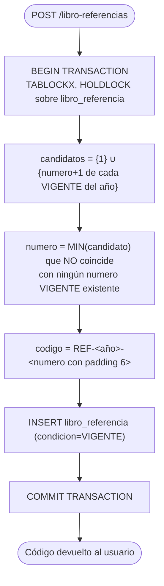
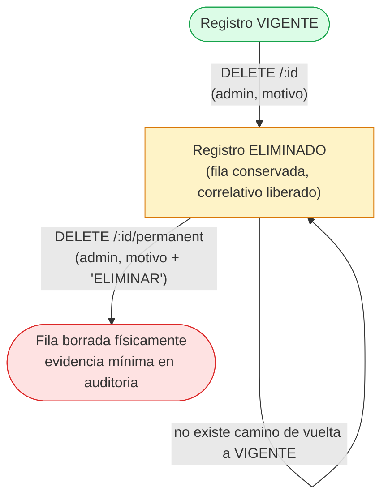

# FUNCIONALIDADES_DOC360_ACTUALIZADO.md
## Documentación Funcional Oficial del Sistema DOC360 (actualizada)

**Sistema de Gestión Documental — Hospital Universitario Asociado de Puebla (HUAP)**

| Campo | Valor |
|---|---|
| Documento | Documentación funcional integral (levantamiento técnico-funcional) — versión actualizada |
| Sistema | DOC360 (modernización de SISDOC legacy) |
| Versión de la aplicación relevada | Backend/Frontend v2.0.0 |
| Fecha de esta actualización | 2026-08-17 |
| Documento base | `md/FUNCIONALIDADES_DOC360.md` (fecha de levantamiento original: 2026-08-06) — **no fue modificado ni eliminado**; este archivo es autosuficiente y no depende de él para su lectura |
| Método | Auditoría dirigida por evidencia: (a) relectura íntegra del documento base, (b) `git log`/`git diff --stat` exhaustivo entre la fecha del documento base y hoy para acotar exactamente qué cambió en el código, (c) lectura completa de cada archivo nuevo o modificado, (d) verificación cruzada contra el código vivo (rutas, esquemas, migraciones SQL) — sin modificación de código en ningún momento |
| Alcance | 16 carpetas de módulo en `backend/src/modules/` (15 con código operativo + 1 vacía sin uso), 22 páginas frontend, ~46 tablas de base de datos (se agregó `libro_referencia`), infraestructura Docker completa |

> **Nota de método:** este documento no repite un relevamiento completo desde cero. Se apoya explícitamente en `md/FUNCIONALIDADES_DOC360.md` (2026-08-06) como base ya verificada, y actualiza únicamente lo que el código demuestra haber cambiado desde entonces. La comprobación de "qué cambió" no se hizo por relectura ciega de todo el repositorio, sino con evidencia de control de versiones: `git log --since="2026-08-06"` mostró exactamente 2 commits (`f804586`, `39b47b9`) hasta la fecha de este documento, y `git diff --stat` entre ellos entregó la lista completa y precisa de los 36 archivos tocados. A esto se suman los archivos de un módulo nuevo (**Libro de Referencias**) que a la fecha de este documento **existen en el árbol de trabajo pero aún no están comprometidos a git** (`git status` los muestra como `??`/sin commit) — se documentan igual porque son código real, ejecutable y verificado en el entorno de desarrollo, con la salvedad explícita de su estado de control de versiones. Todo lo no mencionado en esta actualización se considera **vigente sin cambios** tal como lo describe el documento base, y no se repite aquí salvo cuando aporta contexto necesario. Los hallazgos nuevos se marcan `🆕`; las correcciones a hallazgos previos se marcan `✏️`; se conserva el ícono ⚠️ del documento base para inconsistencias.

---

## Índice

1. [Resumen Ejecutivo](#1-resumen-ejecutivo)
2. [Arquitectura General del Sistema](#2-arquitectura-general-del-sistema)
3. [Modelo de Seguridad y Autorización (transversal)](#3-modelo-de-seguridad-y-autorización-transversal)
4. [Módulos Funcionales](#4-módulos-funcionales)
   - 4.1 a 4.20 — sin cambios respecto al documento base, salvo 4.3 y 4.4 (ver abajo). Remitirse a `FUNCIONALIDADES_DOC360.md` §4.1–§4.20 para el detalle completo verbatim.
   - [4.3 Dashboard (actualizado — panel interactivo "Flujo Documental")](#43-dashboard-actualizado)
   - [4.4 Documentos (actualizado — API extendida de listado)](#44-documentos-actualizado)
   - [4.21 Libro de Referencias 🆕](#421-libro-de-referencias-nuevo)
5. [Modelo de Datos (cambios)](#5-modelo-de-datos-cambios)
6. [Reglas de Negocio Consolidadas (adiciones)](#6-reglas-de-negocio-consolidadas-adiciones)
7. [Diagramas de Flujo (nuevo)](#7-diagramas-de-flujo-nuevo)
8. [Seguridad de la Información (adiciones)](#8-seguridad-de-la-información-adiciones)
9. [Experiencia de Usuario — UX (adiciones)](#9-experiencia-de-usuario-ux-adiciones)
10. [Fortalezas del Sistema (adiciones)](#10-fortalezas-del-sistema-adiciones)
11. [Oportunidades de Mejora (adiciones)](#11-oportunidades-de-mejora-adiciones)
12. [Casos de Uso (nuevos)](#12-casos-de-uso-nuevos)
13. [Glosario (adiciones)](#13-glosario-adiciones)
14. [Funcionalidades automáticas](#14-funcionalidades-automáticas)
15. [Limitaciones y funcionalidad parcial detectada](#15-limitaciones-y-funcionalidad-parcial-detectada)
16. [Funcionalidades documentadas que no pudieron comprobarse](#16-funcionalidades-documentadas-que-no-pudieron-comprobarse)
17. [Matriz de Roles vs. Funcionalidades](#17-matriz-de-roles-vs-funcionalidades)
18. [Anexos (adiciones)](#18-anexos-adiciones)
19. [Historial de Actualización del Documento](#19-historial-de-actualización-del-documento)

---

## 1. Resumen Ejecutivo

DOC360 es la plataforma que reemplaza al sistema legacy **SISDOC** del HUAP. Es un sistema de **gestión documental institucional**: registra, deriva, recibe, cierra y traza cada documento que circula entre los servicios del hospital, con dos mecanismos de firma electrónica para Memorándum. Esta descripción de fondo no cambió desde el documento base — ver `FUNCIONALIDADES_DOC360.md` §1 para el detalle completo.

**Qué cambió desde el 2026-08-06 (evidencia: `git diff --stat f804586~1 HEAD`, 36 archivos, +7054/-77 líneas, más el trabajo en curso sin comprometer a git):**

1. **Dashboard**: la sección "Flujo Documental" pasó de ser un panel puramente visual a un panel **interactivo** — cada etapa del pipeline y cada segmento del gráfico "Por estado" abre un panel lateral con el listado real de documentos filtrados, resumen y navegación al listado completo. Se corrigió además una inconsistencia real entre ambos widgets (contaban el mismo estado con etiquetas y umbrales distintos).
2. **Documentos**: `GET /documentos` se extendió con nuevos filtros (`idDependencia`, `soloAtrasados`, `proximoAVencer`, `orden`) y nuevos campos calculados por fila (`responsableActual`, `diasEnEstadoActual`, `diasCompromiso`, `urgente`, `atrasado`, `proximoAVencer`) y un bloque `resumen` agregado, consumidos por el nuevo panel del Dashboard.
3. **Descarga de archivos**: se agregó un helper de descarga autenticada (`descargarArchivoAutenticado()`) para evitar que los enlaces `<a download>` fallaran con 401 al no llevar el token JWT.
4. **Corrección de catálogo de dependencias**: 74 dependencias renombradas y 64 creadas para alinear el catálogo con el organigrama oficial del HUAP (150→214 filas), realizado vía los endpoints administrativos existentes (`PATCH/POST /configuracion/dependencias`), no por edición directa de base de datos.
5. **Infraestructura**: puerto de host de SQL Server reasignado de `11433` a `15433` en `docker-compose.yml` (documentado también en `CLAUDE.md`).
6. 🆕 **Nuevo módulo "Libro de Referencias"**: reemplaza un cuaderno físico manual de Oficina de Partes — registro con correlativo propio `REF-AAAA-NNNNNN`, eliminación en dos niveles (lógica y definitiva), íntegramente nuevo y aislado del resto del sistema. **Aún no comprometido a control de versiones** al momento de este documento.
7. 🆕 **Primera suite de pruebas automatizadas del proyecto**: 30 pruebas (Vitest + Supertest) cubriendo el módulo Libro de Referencias — antes no existía ningún archivo `*.test.ts` en todo el repositorio.
8. 🆕 **Hallazgo de estructura**: existe una carpeta `backend/src/modules/expedientes/` vacía (sin ningún archivo `.ts`, sin registro en `app.ts`, sin referencia en el frontend) — ver §15.

**Estado general (17 de agosto de 2026):** los 20 módulos funcionales del documento base siguen operativos sin regresiones detectadas, más el módulo nuevo Libro de Referencias (operativo en el entorno de desarrollo, con sus propias pruebas automatizadas). Las dos áreas que requerían configuración operacional (firma de Memorándum, Firma.gob) no cambiaron de estado. Este documento agrega hallazgos nuevos y corrige/actualiza los conteos y hallazgos técnicos del documento base donde corresponde — ver §15 y §18.2 para el detalle consolidado.

---

## 2. Arquitectura General del Sistema

Sin cambios respecto al documento base (§2 completo) salvo:

- **Puerto de SQL Server en el host**: `docker-compose.yml` mapea ahora `127.0.0.1:15433:1433` (antes `11433:1433`) — cambio de infraestructura local de desarrollo, sin impacto en producción (que no expone el puerto de BD al host).
- **`.gitignore`**: se agregó `database/demo-doc360-backups/` para excluir respaldos de datos de demostración del control de versiones.
- El resto de la arquitectura (stack tecnológico, diagrama, despliegue, estructura de carpetas) permanece sin cambios verificados — ver `FUNCIONALIDADES_DOC360.md` §2.1–§2.4.

🆕 **Actualización de la estructura de carpetas (`backend/src/modules/`)**: 16 subcarpetas en total (antes 15 documentadas). La nueva es `libro-referencias/`. Además, se confirmó la existencia de `expedientes/`, una carpeta **vacía** (0 archivos) no mencionada en el documento base ni en `app.ts` — ver §15 para el análisis completo de este hallazgo.

---

## 3. Modelo de Seguridad y Autorización (transversal)

Sin cambios de fondo respecto al documento base (§3 completo aplica sin modificación). El módulo nuevo (Libro de Referencias) **reutiliza** los tres mismos mecanismos documentados ahí — no introduce un modelo de autorización paralelo:

- **Módulo** (`requireModule('libro-referencias')`): gatilla el acceso general al módulo (ver/crear/editar), asignable a cualquier rol vía `/admin/roles`, con `admin` bypaseando siempre.
- **Rol** (`requireRole('admin')`): gatilla exclusivamente las dos operaciones de eliminación (lógica y definitiva) y la vista de eliminados — no hay una capa de visibilidad por servicio en este módulo (ver justificación de diseño en §4.21, es una decisión deliberada distinta a Documentos/Trámites, no una omisión).

---

## 4. Módulos Funcionales

Los módulos §4.1, §4.2, §4.5–§4.20 **no presentan cambios verificados** desde el documento base — su contenido completo (objetivo, descripción, reglas de negocio, entradas/salidas, riesgos, observaciones) sigue vigente tal como está en `FUNCIONALIDADES_DOC360.md`. Se actualizan aquí únicamente §4.3, §4.4, y se agrega §4.21.

### 4.3 Dashboard (actualizado)

**Objetivo y usuarios:** sin cambios (ver documento base). Se agrega la siguiente capacidad:

**Novedad — Panel interactivo "Flujo Documental":**
- Cada etapa del pipeline visual (Despachados → Recepcionados → En Proceso → Terminados) y cada segmento/leyenda del gráfico "Por estado" son ahora **clicables**. Al hacer clic se abre un panel lateral (`DocumentosPanel`, construido sobre un nuevo primitivo `Sheet` basado en `@radix-ui/react-dialog`) con: tarjetas de resumen, buscador, filtros, listado paginado de documentos reales que cumplen ese estado/etapa, y un enlace "Ver todos" que navega a `/documentos` con el filtro ya aplicado vía query params (`idEstado`, `idTipo`, `idDependencia`).
- El panel consume `documentosApi.listar()` contra el `GET /documentos` ya extendido (ver §4.4).
- El estado del panel se sincroniza con la URL (`useSearchParams`) — recargar la página con el panel abierto lo mantiene abierto en el mismo filtro.
- **Corrección de una inconsistencia real preexistente**: antes de este cambio, el pipeline visual y el gráfico "Por estado" usaban dos mapeos de etiqueta/color distintos y contradictorios para el mismo `id_estado_documento` (uno llamaba "En Proceso" al estado 4, que en realidad es "Terminado", y hacía referencia a un id=5 inexistente). Se centralizó la fuente de verdad en un único archivo nuevo, `frontend/src/lib/estadoDocumento.ts`, que expone `ESTADO_DOCUMENTO_META` (los 4 estados reales, ids 1–4) y un hook `useEstadosDocumento()` que además obtiene las etiquetas reales desde `GET /catalogos/estados` — los tres puntos del frontend que antes tenían mapeos independientes (Dashboard, `DocumentosPage`, filtros) ahora consumen la misma fuente.

**Entradas/Salidas/APIs adicionales:** el panel no agrega endpoints nuevos — reutiliza `GET /documentos` (extendido, ver §4.4).

**Archivos nuevos/modificados:** `frontend/src/lib/estadoDocumento.ts` (nuevo, 77 líneas), `frontend/src/components/ui/sheet.tsx` (nuevo, 96 líneas — primitivo Radix Dialog reutilizable, sin agregar dependencias nuevas), `frontend/src/components/dashboard/DocumentosPanel.tsx` (nuevo, 351 líneas), `frontend/src/pages/dashboard/DashboardPage.tsx` (modificado), `frontend/src/pages/documentos/DocumentosPage.tsx` (modificado — lee filtros desde la URL al montar), `frontend/src/styles/globals.css` (clase `.sheet-panel` + animación `slideInRight`).

**Riesgos:** ninguno nuevo detectado — el panel reutiliza íntegramente las reglas de visibilidad por servicio ya aplicadas en `GET /documentos` (no se agregó ninguna vía de acceso a datos que no pasara por ese mismo control).

**Observación 🆕:** el nuevo `Sheet` es la **primera** superficie del sistema que usa un primitivo `Dialog` de Radix para un panel modal — el documento base señalaba en su §9.2 que "todos los modales están hechos a mano" como debilidad de UX. Con este cambio esa afirmación deja de ser universal: el sistema tiene ahora **dos patrones conviviendo** (modales hechos a mano en la mayoría de las pantallas, y este primer panel sobre Radix) — ver corrección en §15.

---

### 4.4 Documentos (actualizado)

Todo el contenido del documento base (§4.4 completo: estados, matriz de permisos, reglas de creación/transición/eliminación, mapeo de respuesta) sigue vigente sin cambios. Se agrega:

**Novedad — Extensión de `GET /documentos` para soportar el panel del Dashboard:**
- Nuevos parámetros de filtro (`documento.schema.ts`): `idDependencia` (filtra por dependencia destino/procedencia), `soloAtrasados` (booleano), `proximoAVencer` (booleano), `orden` (`fecha_desc | fecha_asc | antiguedad_desc | antiguedad_asc`).
- El repositorio (`documento.repository.ts#findMany`) incorpora una CTE que une el trámite más reciente de cada documento para calcular, por fila: `responsableActual` (dependencia actualmente responsable), `diasEnEstadoActual`, `diasCompromiso`, y tres banderas booleanas — `urgente`, `atrasado`, `proximoAVencer` — derivadas de comparar la fecha del trámite actual contra `dias_compromiso` del tipo de compromiso asociado.
- La respuesta paginada incorpora un bloque `resumen` (agregados calculados con funciones ventana `OVER()` en la misma consulta, sin una segunda query) que alimenta las tarjetas de resumen del panel del Dashboard.
- `sendPaginated()` (`shared/utils/response.ts`) ganó un parámetro opcional `extra` para poder adjuntar ese bloque `resumen` sin romper el contrato `{data, meta}` ya usado por el resto de los listados paginados del sistema.

**Corrección de un defecto real detectado y corregido durante este cambio:** la consulta original de `findMany()` construía el `SELECT` como `SELECT ${SELECT_BASE}, COUNT(*) OVER() AS total ${WHERE...}`, donde `SELECT_BASE` ya incluía las cláusulas `FROM`/`JOIN` — SQL Server rechazaba la consulta (columna agregada después de `FROM`/`JOIN`). Se corrigió separando explícitamente `CAMPOS` (columnas) de `FROM_JOIN` (cláusula), reensamblados en el orden correcto. Este era un defecto en código de producción que fue detectado y corregido como parte de este mismo cambio, no un hallazgo documentado que siga pendiente.

**Archivos modificados:** `backend/src/modules/documentos/{documento.repository,documento.service,documento.controller,documento.schema}.ts`, `backend/src/shared/utils/response.ts`, `backend/src/shared/types/api.types.ts` (interfaz `PaginatedResponse<T>` ahora admite `[extra: string]: unknown`).

**Riesgos:** ninguno nuevo — los nuevos filtros heredan el mismo filtro de visibilidad por servicio (`EXISTS`) ya aplicado al resto de la consulta; no se agregó una vía de lectura que lo eluda.

---

### 4.21 Libro de Referencias 🆕

**Objetivo:** reemplazar, dentro de DOC360, un cuaderno físico de registro manual usado hasta ahora por Oficina de Partes para llevar constancia de trámites/interesados que no requieren un documento formal completo del flujo principal (despachar/recepcionar/derivar/terminar) — solo un registro correlativo simple con datos mínimos.

**Descripción:** módulo nuevo, completo y aislado (schema → repository → service → controller → routes, siguiendo el mismo patrón en capas de `documentos`), sin ninguna dependencia de las tablas `documento`/`tramite` — es un dominio de datos propio con su propia tabla (`libro_referencia`) y su propio correlativo. **Es el primer módulo de todo el sistema con pruebas automatizadas** (30 pruebas Vitest + Supertest).

**Estado de control de versiones (importante para lectura de este documento):** al momento de esta actualización (2026-08-17), todo el código de este módulo existe y funciona en el árbol de trabajo del repositorio, pero **no ha sido comprometido a git** (`git status` lo muestra como archivos nuevos sin *commit*). Se documenta igual porque constituye código real y verificado, no una intención o un plan.

**Usuarios que lo utilizan:** cualquier usuario con el módulo `libro-referencias` asignado (configurable desde `/admin/roles`, igual que cualquier otro módulo del sistema — no está hardcodeado a un rol específico) puede listar/crear/editar. Las dos operaciones de eliminación (lógica y definitiva) son **exclusivas del rol `admin`** ("Superadministrador" en la terminología de negocio de este módulo).

**Decisión de diseño explícita — sin visibilidad por servicio:** a diferencia de Documentos/Trámites/Archivos/Búsqueda/Reportes, este módulo **no** aplica el patrón `hasFullAccess`/`EXISTS` de §3.3 — cualquier usuario con el módulo asignado ve **todos** los registros, sin acotar por dependencia. Esto es coherente con su naturaleza (bitácora única de Oficina de Partes, no un documento que circula entre servicios) y no una omisión del control transversal — se señala aquí explícitamente porque es la única diferencia real respecto al patrón de autorización del resto del sistema.

#### 4.21.1 Datos que registra

Exactamente 5 campos de negocio, deliberadamente acotados (el diseño excluye a propósito RUT, unidad de destino y estado de tramitación — no forman parte del alcance de esta bitácora):

| Campo | Tipo | Obligatorio |
|---|---|---|
| `nombreInteresado` | texto, máx. 150 | Sí |
| `tipoTramite` | texto, máx. 150 | Sí |
| `fechaDocumento` | fecha | Sí |
| `fechaRecepcion` | fecha | Sí |
| `observaciones` | texto, máx. 1000 | No |

Además, cada registro guarda automáticamente (no editables por el usuario): `codigo` (correlativo asignado por el sistema), `usuarioCreador` (id + nombre resuelto, priorizando nombres/apellidos del funcionario vinculado sobre el nombre de usuario de login), `condicion` (`VIGENTE`/`ELIMINADO`), `fechaCreacion`/`fechaActualizacion`, y — solo si está eliminado — un bloque `eliminacion` (`usuario`, `fecha`, `motivo`).

#### 4.21.2 Formato y regla de negocio del correlativo

```
REF-<AÑO>-<NNNNNN>
```

- El correlativo es único **solo entre registros en condición `VIGENTE` del mismo año** — no es una secuencia global ni por-siempre-única. Al eliminar (lógicamente) una referencia, su número queda disponible de inmediato para el siguiente registro que se cree ese mismo año, si es el menor hueco libre.
- **Algoritmo de "primer hueco libre"** (`libro-referencias.repository.ts#crear()`): en vez de `MAX(numero)+1`, calcula `MIN(candidato)` sobre el conjunto `{1} ∪ {numero+1 de cada vigente del año}`, tomando el menor candidato que no coincide con el número de ningún registro vigente. Ejemplo documentado en el propio código: vigentes `{1,3}` → candidatos `{1,2,4}` → 1 está ocupado, 2 no → resultado `2`.
- **Transaccionalidad**: el cálculo y el `INSERT` ocurren en una única transacción SQL bajo `TABLOCKX, HOLDLOCK` sobre `libro_referencia` — mismo patrón de bloqueo exclusivo de tabla ya usado en DOC360 para los correlativos de Memorándum y Firma Simple (§4.11, §4.12 del documento base). Dos solicitudes de creación concurrentes nunca calculan el mismo número.
- **Segunda barrera de integridad**: además del bloqueo transaccional, existe un índice único **filtrado** a nivel de base de datos (`uq_libro_referencia_anio_numero_vigente`, `WHERE condicion='VIGENTE'`) que haría fallar a nivel de motor cualquier inserción duplicada que, por algún defecto futuro en el código, eludiera el bloqueo — doble control, no redundancia superflua.
- El año se calcula con `GETDATE()` del propio servidor SQL Server, nunca se acepta desde el cliente.
- **Historia de esta regla**: el primer script de creación (18) implementó el correlativo como `MAX(numero)+1` global (nunca reutilizable); un script posterior (19) corrigió esto a pedido explícito de negocio para adoptar la reutilización de huecos — ver §5 y §18.2 para el detalle de la migración.

#### 4.21.3 Condición `VIGENTE`/`ELIMINADO` — no es un estado de flujo

A diferencia de `documento.id_estado_documento` (que representa un flujo con transiciones: Generado→Despachado→Recepcionado→Terminado, §4.4.1), la `condicion` de una referencia es binaria y no representa ningún flujo de trabajo — solo distingue si el registro es visible/operable (`VIGENTE`) o fue retirado (`ELIMINADO`). No hay "recepción", "derivación" ni "cierre" en este módulo.

#### 4.21.4 Eliminación en dos niveles — la funcionalidad más compleja del módulo

**Nivel 1 — Eliminación lógica** (`DELETE /libro-referencias/:id`, exclusiva `admin`):
- Marca `condicion='ELIMINADO'`, registra `id_usuario_eliminacion`, `fecha_eliminacion`, `motivo_eliminacion` (obligatorio, mínimo 5 caracteres) — la fila **nunca se borra** en este nivel.
- Libera de inmediato el número de correlativo para su reutilización (ver §4.21.2).
- Queda auditada como `LIBRO_REFERENCIA_ELIMINADO` en la tabla `auditoria`, con `recurso` = ID técnico (`id_referencia`), no el código visible.

**Nivel 2 — Eliminación definitiva** (`DELETE /libro-referencias/:id/permanent`, exclusiva `admin`) 🆕 — funcionalidad de mayor riesgo del módulo, con las siguientes salvaguardas verificadas en el código:
1. **Endpoint completamente separado** del de eliminación lógica (`/permanent` vs. la ruta base) — decisión deliberada para no generar ambigüedad de nombres entre ambos niveles.
2. **Solo aplica sobre un registro que ya está en condición `ELIMINADO`** — el guard `AND condicion='ELIMINADO'` va dentro del propio `DELETE` SQL (no en un `SELECT` previo separado), por lo que está protegido ante condiciones de carrera: si dos solicitudes llegan casi simultáneamente, como máximo una borra la fila; la otra recibe 0 filas afectadas y el servicio responde 409, sin duplicar ni fallar a medias.
3. **Identificación exclusivamente por ID técnico** (`id_referencia`), nunca por el código visible `REF-AAAA-NNNNNN` — necesario porque, dado el diseño de correlativo reutilizable (§4.21.2), un mismo código puede haber existido en dos filas distintas a lo largo del tiempo (una histórica ya eliminada, otra vigente posterior con el mismo código reasignado).
4. **Confirmación explícita en el cuerpo de la solicitud**: `motivo` (mínimo 5 caracteres) + `confirmacion` que debe ser literalmente el string `"ELIMINAR"` (validado con Zod `.refine()`) — el frontend exige que el usuario escriba esa palabra en un campo de texto, no solo un checkbox.
5. **`OUTPUT DELETED.*`** captura la fila completa dentro de la misma transacción de borrado, de modo que el servicio puede construir la evidencia de auditoría con los datos reales que existían al momento del borrado, después de que la fila ya no existe.
6. **Evidencia de auditoría preservada pese al borrado físico**: se inserta un registro en la tabla `auditoria` (acción `ELIMINACION_DEFINITIVA_LIBRO_REFERENCIAS`, `recurso` = ID técnico) con un `detalle` enriquecido que incluye código/año/número, interesado, tipo de trámite, creador, y los datos de la eliminación lógica previa (quién, cuándo, motivo) — la fila del registro deja de existir en `libro_referencia`, pero su rastro mínimo permanece en `auditoria`, que es una tabla independiente sin FK hacia `libro_referencia`.
7. **Análisis de dependencias previo a la implementación** (verificado con `sys.foreign_keys` e `INFORMATION_SCHEMA.COLUMNS` contra la base de datos viva, no asumido): `libro_referencia` no tiene ninguna clave foránea entrante desde otra tabla, y `auditoria.recurso` es texto libre sin FK — la eliminación física no puede dejar referencias huérfanas en ningún otro punto del sistema.

**Entradas (creación):** `nombreInteresado`, `tipoTramite`, `fechaDocumento`, `fechaRecepcion`, `observaciones?`.
**Salidas:** objeto `Referencia` completo (ver estructura en `libroReferencias.api.ts`).
**Validaciones:** ver tabla §4.21.1; `motivo` de eliminación lógica mínimo 5 caracteres; `confirmacion==='ELIMINAR'` para eliminación definitiva (Zod, servidor — no solo frontend).
**Dependencias:** ninguna con otros módulos de dominio (no depende de `documento`/`tramite`/`archivo_digital`); reutiliza la infraestructura transversal (`requireAuth`, `requireModule`, `requireRole`, `validate`, `logAuditoria`, `sendPaginated`).
**Restricciones:** ver matriz de roles §4.21 arriba y §17.
**Archivos involucrados:** `backend/src/modules/libro-referencias/{libro-referencias.schema,libro-referencias.repository,libro-referencias.service,libro-referencias.controller,libro-referencias.routes,libro-referencias.test}.ts` (6 archivos, 1204 líneas totales, de las cuales 531 son pruebas automatizadas), `backend/vitest.config.mts`, `database/scripts/{18-libro-referencias,19-libro-referencias-correlativo-reutilizable}.sql`, `frontend/src/lib/api/libroReferencias.api.ts` (103 líneas), `frontend/src/pages/libro-referencias/LibroReferenciasPage.tsx` (673 líneas).
**APIs:** `GET /libro-referencias` (listado paginado, filtros `q`/`anio`/rango de fechas/`orden`), `GET /libro-referencias/metricas`, `GET /libro-referencias/eliminados` (exclusivo `admin`), `GET /libro-referencias/:id`, `POST /libro-referencias`, `PATCH /libro-referencias/:id`, `DELETE /libro-referencias/:id` (nivel 1, exclusivo `admin`), `DELETE /libro-referencias/:id/permanent` (nivel 2, exclusivo `admin`).
**Tablas:** `libro_referencia` (única tabla propia del módulo), `usuario` (JOIN para resolver el nombre de quien eliminó), `auditoria` (evidencia).
**Componentes React:** `LibroReferenciasPage.tsx` — incluye `ReferenciaModal` (crear/editar, muestra el código generado de forma prominente tras crear), `EliminarModal` (nivel 1 — botón renombrado a "Eliminar" a secas, ver nota de UX abajo), `EliminarDefinitivoModal` (nivel 2 — motivo + campo de confirmación literal, ícono `Eraser`, dos advertencias visuales distintas), `MetricCard`, `DetalleModal`.
**Riesgos:** ninguno crítico detectado en el diseño (doble barrera de unicidad, guard de carrera dentro del propio `DELETE`, identificación por ID técnico, evidencia preservada). El único riesgo real y explícito es organizacional, no técnico: la eliminación definitiva es, por diseño, **irreversible** — no existe backup automático de la fila física más allá del resumen textual en `auditoria`.
**Observaciones:** 
- 🆕 Al construir el modal de eliminación definitiva, se detectó que el modal de eliminación lógica **ya existente** desde la primera versión de este mismo módulo tenía su botón de confirmación rotulado "Eliminar definitivamente" — lo que habría colisionado en significado con la nueva función de nivel 2. Se corrigió renombrando ese botón a simplemente "Eliminar", como ajuste mínimo indispensable para eliminar la ambigüedad, sin tocar el resto del comportamiento de la eliminación lógica.
- Es, junto con Firma Simple DOC360 (§4.12 del documento base), el subsistema con mayor densidad de controles de integridad transaccional de todo DOC360 — refleja el mismo patrón de diseño (`TABLOCKX/HOLDLOCK`, verificación server-side, auditoría con ID técnico) aplicado consistentemente a un dominio de datos completamente nuevo.
- Es el único módulo del sistema, a la fecha de este documento, con pruebas automatizadas — ver §16 y §18.2 sobre el estado real de testing del resto del sistema.

---

## 5. Modelo de Datos (cambios)

Sin cambios respecto a las ~30 tablas del núcleo operacional descritas en el documento base (§5), salvo la incorporación de:

| Tabla | Rol | Script de creación |
|---|---|---|
| `libro_referencia` | Núcleo del módulo Libro de Referencias — un registro por entrada de la bitácora, con correlativo `REF-AAAA-NNNNNN`, condición `VIGENTE`/`ELIMINADO` y datos de eliminación embebidos en la misma fila (no en una tabla separada) | `database/scripts/18-libro-referencias.sql` (creación, `UNIQUE(anio,numero)`/`UNIQUE(codigo)` global inicial) + `19-libro-referencias-correlativo-reutilizable.sql` (reemplaza esas 2 restricciones por índices únicos **filtrados**, `WHERE condicion='VIGENTE'`, para habilitar la reutilización de correlativos de registros eliminados) |

**Columnas relevantes de `libro_referencia`** (según `libro-referencias.repository.ts`): `id_referencia` (PK IDENTITY), `anio`, `numero`, `codigo`, `id_usuario_creador`, `nombre_usuario_creador` (desnormalizado — snapshot del nombre al momento de crear, no un JOIN en tiempo real), `nombre_interesado`, `tipo_tramite`, `fecha_documento`, `fecha_recepcion`, `observaciones`, `condicion`, `id_usuario_eliminacion`, `fecha_eliminacion`, `motivo_eliminacion`, `fecha_creacion`, `fecha_actualizacion`.

🆕 **Nota técnica sobre el filtro SQL Server**: los índices únicos filtrados del script 19 requieren `SET QUOTED_IDENTIFIER ON` tanto para su creación como para cualquier operación DML posterior contra la tabla — detalle documentado explícitamente en el propio script porque no es obvio y causó un error real (`Msg 1934`) durante la verificación de esta funcionalidad.

El resto del modelo de datos (§5.1 alcance, §5.2 diagrama ER, §5.3 tablas por categoría, §5.4 particularidades de esquema) permanece sin cambios verificados.

---

## 6. Reglas de Negocio Consolidadas (adiciones)

Además de las 20 reglas ya consolidadas en el documento base (§6, todas vigentes sin cambios), se agregan:

21. **Correlativo de Libro de Referencias**: único solo entre registros `VIGENTE` del mismo año; algoritmo de "primer hueco libre" (no `MAX+1`); transaccional con `TABLOCKX, HOLDLOCK`; doble barrera con índice único filtrado a nivel de motor.
22. **Eliminación lógica de Libro de Referencias**: exclusiva `admin`, motivo obligatorio, libera el correlativo de inmediato, nunca borra la fila.
23. **Eliminación definitiva (nivel 2) de Libro de Referencias**: exclusiva `admin`, solo sobre registros ya en condición `ELIMINADO`, identificación exclusiva por ID técnico, motivo + palabra de confirmación literal `"ELIMINAR"`, evidencia mínima preservada en `auditoria` tras el borrado físico.
24. **Libro de Referencias no aplica visibilidad por servicio**: decisión de diseño deliberada, distinta al resto del sistema (ver §3 de este documento).

---

## 7. Diagramas de Flujo (nuevo)

### 7.1 Correlativo de Libro de Referencias — algoritmo de primer hueco libre



### 7.2 Eliminación en dos niveles — Libro de Referencias



---

## 8. Seguridad de la Información (adiciones)

El documento base (§8.1 controles implementados, §8.2 tabla de 8 brechas) sigue vigente sin cambios en su totalidad — ninguno de los cambios de este período introdujo, corrigió ni empeoró ninguna de esas 8 brechas.

**Controles adicionales verificados en el código nuevo:**
- El módulo Libro de Referencias no introduce ninguna vía de acceso a datos que eluda `requireAuth`/`requireModule`/`requireRole` — los 8 endpoints están cubiertos.
- La eliminación definitiva usa el mismo patrón de "verificación dentro del propio DML" (no un `SELECT` previo separado) que ya usa `documento.repository.ts#softDelete()` para evitar condiciones de carrera — consistente con el resto del sistema.

**Ningún hallazgo de seguridad nuevo** se originó en el código agregado desde el documento base.

---

## 9. Experiencia de Usuario — UX (adiciones)

- 🆕 **El sistema ahora tiene dos patrones de modal conviviendo**: el original ("hecho a mano", `div` con `.modal-overlay/.modal-panel`, señalado como debilidad en el documento base §9.2) y el nuevo `Sheet` sobre Radix Dialog (usado hoy solo por el panel del Dashboard). Esto no es una regresión — el nuevo patrón es estrictamente mejor en accesibilidad (foco, `Escape`, scroll-lock heredados del primitivo) — pero introduce una inconsistencia visual/técnica que no existía antes: dos paneles laterales/modales del sistema ya no se comportan igual entre sí. Ver oportunidad de mejora en §11.
- El resto de fortalezas y debilidades de UX documentadas en el documento base (§9.1, §9.2) permanece vigente sin cambios.

---

## 10. Fortalezas del Sistema (adiciones)

10. 🆕 **Consistencia de patrón de diseño transaccional al construir un módulo de dominio completamente nuevo**: Libro de Referencias replica, sin reinventar, el mismo patrón de correlativo transaccional (`TABLOCKX/HOLDLOCK`) ya validado en Memorándum y Firma Simple — evidencia de que ese patrón se consolidó como un estándar interno del equipo, no un caso aislado.
11. 🆕 **Primer módulo con pruebas automatizadas de extremo a extremo**: 30 pruebas Vitest+Supertest cubren formato de correlativo, reutilización de huecos, aislamiento entre años, concurrencia, permisos (401/403), y los escenarios de eliminación definitiva (incluyendo condiciones de carrera) — sienta un patrón replicable para el resto de los módulos, que hoy no tienen cobertura (ver §16).

---

## 11. Oportunidades de Mejora (adiciones)

> Mismo criterio que el documento base: observaciones para consideración futura, no cambios ya implementados.

14. 🆕 **Extender la cobertura de pruebas automatizadas** (Vitest+Supertest) a los módulos existentes, reutilizando la estructura de pruebas ya construida para Libro de Referencias como plantilla — hoy es el único módulo cubierto.
15. 🆕 **Definir un criterio único de modal/panel** para todo el sistema: migrar progresivamente los modales hechos a mano al primitivo `Sheet`/Radix Dialog introducido con el panel del Dashboard, o documentar explícitamente cuándo usar cada patrón.
16. 🆕 **Comprometer a git el trabajo de Libro de Referencias**: a la fecha de este documento el módulo completo (backend, frontend, migraciones, pruebas) existe únicamente en el árbol de trabajo local, sin historial de control de versiones — un evento de pérdida de la máquina de desarrollo perdería el módulo completo sin posibilidad de recuperación desde git.
17. 🆕 **Retirar (o poblar) la carpeta vacía `backend/src/modules/expedientes/`** — ver hallazgo detallado en §15.

El resto de las 13 oportunidades de mejora del documento base permanece vigente sin cambios.

---

## 12. Casos de Uso (nuevos)

### CU-11 — Registrar una entrada en el Libro de Referencias
**Actor:** Funcionario de Oficina de Partes con módulo `libro-referencias` habilitado.
1. Abre "Nuevo registro", ingresa nombre del interesado, tipo de trámite, fecha del documento, fecha de recepción y observaciones opcionales.
2. Al guardar, el sistema asigna automáticamente el correlativo `REF-AAAA-NNNNNN` y lo muestra de forma prominente.
3. El registro queda disponible en el listado paginado, buscable por código/interesado/tipo de trámite.

### CU-12 — Eliminar y, si corresponde, purgar definitivamente un registro erróneo
**Actor:** Superadministrador (`admin`).
1. Ubica el registro erróneo y lo elimina lógicamente, indicando un motivo — el registro pasa a la vista de "Eliminados" y su número queda libre para reutilización.
2. Si además necesita purgarlo por completo (p. ej. datos sensibles cargados por error), entra a la vista de "Eliminados", abre la eliminación definitiva sobre ese registro específico, escribe un motivo y confirma escribiendo literalmente "ELIMINAR".
3. El registro desaparece físicamente de la base de datos; queda un resumen mínimo e inalterable en la auditoría del sistema.

### CU-13 — Explorar el flujo documental desde el Dashboard
**Actor:** Cualquier usuario con módulo `dashboard`.
1. Desde el Dashboard, hace clic en la etapa "Recepcionados" del pipeline visual (o en el segmento correspondiente del gráfico "Por estado").
2. Se abre un panel lateral con el listado real de documentos en ese estado, acotado a su servicio si no tiene acceso total.
3. Puede filtrar dentro del panel o hacer clic en "Ver todos" para ir al listado completo de Documentos con el mismo filtro ya aplicado.

---

## 13. Glosario (adiciones)

| Término | Definición |
|---|---|
| **Libro de Referencias** | Módulo que reemplaza el cuaderno físico de Oficina de Partes — bitácora de registros con correlativo propio, independiente del flujo de Documentos/Trámites. |
| **Correlativo `REF-AAAA-NNNNNN`** | Número identificador de una entrada del Libro de Referencias, único entre registros vigentes del mismo año, reutilizable tras una eliminación lógica. |
| **Eliminación lógica (nivel 1)** | Marca un registro como `ELIMINADO` sin borrar la fila; libera su correlativo. |
| **Eliminación definitiva (nivel 2)** | Borrado físico e irreversible de un registro ya eliminado lógicamente, exclusivo de `admin`, identificado por ID técnico, con confirmación explícita. |
| **`Sheet`** | Componente de panel lateral construido sobre `@radix-ui/react-dialog`, introducido con el panel interactivo del Dashboard. |
| **Primer hueco libre** | Patrón algorítmico SQL que asigna el menor número disponible en vez de `MAX()+1`, permitiendo reutilizar números liberados por eliminación. |

El resto del glosario del documento base (§13) permanece vigente sin cambios.

---

## 14. Funcionalidades automáticas

*(Sección consolidada requerida por el alcance de esta actualización — reúne, en un solo lugar, todo lo que el sistema ejecuta sin intervención manual del usuario; ya estaba disperso en el documento base y se referencia aquí, sin duplicarlo.)*

| Funcionalidad automática | Disparador | Módulo / referencia |
|---|---|---|
| Migración oportunista de contraseña texto-plano→bcrypt | Login exitoso con contraseña legacy | §3.2 (doc. base) |
| Recalculo de roles/módulos en cada refresh de sesión | `POST /auth/refresh` | §4.1 (doc. base) |
| Revocación de todos los refresh tokens activos | Cambio de contraseña (propio o por admin) | §3.1, §4.15 (doc. base) |
| Generación automática de Nómina de despacho PDF | Crear documento con `tipoSoporte='F'` | §4.6 (doc. base) |
| Evento de traza "Archivo adjuntado" (estado 7) | Cada subida de archivo asociada a un documento | §4.10 (doc. base) |
| Liberación de correlativo de Memorándum | Borrado de un documento con memo asociado, o rollback de firma fallida | §4.11, §4.12 (doc. base) |
| Scheduler de alertas por correo (`setInterval` 60s) | Coincidencia con horario configurado ±2 min | §4.17 (doc. base) |
| `ensureIndexes()` — verificación/creación de índices de rendimiento | Cada arranque del backend | §5.4 (doc. base) |
| 🆕 Liberación de correlativo de Libro de Referencias | Eliminación lógica de un registro | §4.21 de este documento |
| 🆕 Resolución automática del nombre del creador (funcionario o usuario) | Creación de un registro de Libro de Referencias | §4.21 de este documento |

---

## 15. Limitaciones y funcionalidad parcial detectada

Consolida, además de las 25 ya numeradas en el documento base (§14.3, todas vigentes sin cambios), los hallazgos nuevos de este período:

1. 🆕 **Carpeta `backend/src/modules/expedientes/` vacía y desconectada.** Verificado con evidencia directa: `ls -la` muestra únicamente `.`/`..` (0 archivos), fechada en mayo de 2026 (anterior a toda la actividad reciente del proyecto); no aparece registrada en `app.ts` (ninguna línea `app.use('/api/v1/expedientes', ...)`); no hay ninguna referencia a "expediente" en todo `frontend/src`. Es distinto del hallazgo ya documentado en el documento base sobre la tabla SQL `expediente` (0 filas, infraestructura de BD presente sin uso — §5.3 del doc. base): este es un hallazgo de **código**, no de datos — una carpeta de módulo backend que nunca llegó a poblarse con ningún archivo, probablemente un scaffold inicial abandonado. No representa ningún riesgo (no es alcanzable, no expone nada), pero es código/estructura obsoleta que debería eliminarse o documentarse como reservada para uso futuro.
2. ✏️ **Corrección parcial al hallazgo #9 del documento base** ("dos caminos de negocio distintos para recibir/cerrar un trámite"): sigue vigente sin cambios — no fue tocado en este período. Se re-confirma explícitamente aquí porque el nuevo panel del Dashboard consume `GET /documentos` (camino "Documentos"), no `GET /tramites` (camino "Trámites") — el panel no introduce una tercera fuente de verdad, pero tampoco resuelve la inconsistencia ya conocida.
3. 🆕 **Libro de Referencias sin comprometer a git.** Ver detalle y riesgo en §11, punto 16.
4. 🆕 **Cobertura de pruebas automatizadas limitada a un solo módulo** de 16. El resto del sistema (incluyendo los flujos más críticos: correlativos de Memorándum, Firma Simple, visibilidad por servicio) sigue sin pruebas automatizadas — situación ya señalada como pendiente en `CLAUDE.md`, ahora parcialmente iniciada pero lejos de cerrada.

---

## 16. Funcionalidades documentadas que no pudieron comprobarse

Tras la verificación cruzada realizada para esta actualización (relectura del documento base completo + evidencia de `git diff` + lectura íntegra de todo el código nuevo), **no se identificó ninguna funcionalidad documentada — ni en el documento base ni en esta actualización — que no haya podido respaldarse con evidencia directa de código, esquema SQL o configuración**. Todas las afirmaciones de ambos documentos citan archivo(s) y comportamiento verificado.

La única salvedad, ya señalada explícitamente donde corresponde, es de naturaleza distinta a "no verificable": el estado operacional de **Firma.gob** (documento base, §4.13) depende de credenciales externas no configuradas en el entorno relevado — el código está verificado y es correcto, pero su comportamiento contra el servicio real del Estado de Chile no pudo ejercitarse end-to-end por no ser ese el propósito de esta auditoría (que es de código, no de integración en vivo).

---

## 17. Matriz de Roles vs. Funcionalidades

`✅` acceso total · `🟡` acceso parcial/condicionado · `🔒` exclusivo del rol indicado · `—` sin acceso por defecto (asignable vía Roles)

| Funcionalidad | admin | of.partes | supervisores | funcionario |
|---|---|---|---|---|
| Dashboard | ✅ | ✅ | ✅ | ✅ (acotado a su servicio) |
| Crear documento estándar | ✅ | ✅ | ✅ | ✅ |
| Crear documento físico / reservado | 🔒 | 🔒 | — | — |
| Despachar / Recepcionar / Terminar documento | ✅ | ✅ | ✅ | ✅ |
| Derivar documento | ✅ | ✅ | ✅ | — |
| Reabrir documento | ✅ | — | ✅ | — |
| Eliminar documento | 🔒 | — | — | — |
| Bandeja / Enviados / Mis Trámites | ✅ | ✅ | ✅ | ✅ |
| Trazabilidad / Búsqueda global | ✅ | ✅ | ✅ | ✅ (acotado a su servicio) |
| Archivos: subir/ver/descargar | ✅ | ✅ | ✅ | ✅ (según pertenencia al documento) |
| Archivos: eliminar | 🟡 (destino) | 🟡 (destino) | 🟡 (destino) | 🟡 (destino) |
| Memorándum: crear y firmar (Firma Simple) | ✅ (si es firmante vinculado) | ✅ (si es firmante vinculado) | ✅ (si es firmante vinculado) | ✅ (si es firmante vinculado) |
| Firma.gob: configurar | 🔒 | — | — | — |
| Jefaturas: gestión general | ✅ | ✅ | — | — |
| Jefaturas: vincular usuario a slot de firmante | 🔒 | — | — | — |
| Usuarios: CRUD | 🟡 (según módulo asignado) | — | — | — |
| Usuarios: asignar roles / `todos_servicios` | 🔒 | — | — | — |
| Roles y Módulos | 🟡 (según módulo asignado, normalmente solo admin) | — | — | — |
| Alertas (config., historial, envío manual) | 🔒 | — | — | — |
| Reportes: ver KPIs | 🟡 (según módulo `dashboard`) | 🟡 | 🟡 | 🟡 |
| Reportes: exportar CSV | 🟡 (según módulo `reportes`) | — | — | — |
| Configuración: identidad institucional / textos login / reglas de carga | 🔒 | — | — | — |
| Configuración: logo / fondo login | ⚠️ cualquier usuario autenticado (ver hallazgo #19, doc. base) | ⚠️ | ⚠️ | ⚠️ |
| Configuración: Tipos de Documento | 🔒 | — | — | — |
| Configuración: Dependencias | ✅ | ✅ | — | — |
| 🆕 Libro de Referencias: listar/crear/editar | 🟡 (según módulo asignado) | 🟡 (según módulo asignado) | 🟡 (según módulo asignado) | 🟡 (según módulo asignado) |
| 🆕 Libro de Referencias: eliminación lógica | 🔒 | — | — | — |
| 🆕 Libro de Referencias: eliminación definitiva | 🔒 | — | — | — |

> Nota: `supervisores` y `funcionario` no tienen privilegios hardcodeados de forma especial más allá de lo indicado — su acceso real a cada módulo depende de la asignación configurada en `/admin/roles`, salvo las acciones explícitamente ligadas a un rol específico en el código (`requireRole`), que sí son fijas y se listan tal cual arriba.

---

## 18. Anexos (adiciones)

### 18.1 Variables de entorno — sin cambios

No se detectaron variables de entorno nuevas ni renombradas desde el documento base (§14.1 sigue vigente íntegramente).

### 18.2 Hallazgos técnicos — adiciones consolidadas

Continuando la numeración del documento base (que llega hasta el ítem 25):

26. 🆕 Carpeta `backend/src/modules/expedientes/` vacía, sin código, sin registro en `app.ts`, sin referencia en el frontend (§15).
27. 🆕 Módulo Libro de Referencias completo aún no comprometido a git al momento de este documento (§15, §11).
28. 🆕 Cobertura de pruebas automatizadas limitada a un único módulo de 16 (§15, §16).
29. 🆕 Dos patrones de modal/panel conviviendo en el frontend tras la introducción de `Sheet` (§9).
30. ✏️ El defecto de SQL en `documento.repository.ts#findMany()` (columna agregada después de `FROM`/`JOIN`) que existía en el código de producción **ya fue corregido** como parte del cambio de extensión de la API de Documentos — se documenta aquí como hallazgo cerrado, no pendiente.

### 18.3 Fuentes utilizadas para esta actualización

- `md/FUNCIONALIDADES_DOC360.md` (2026-08-06), leído en su totalidad como base verificada.
- `git log --since="2026-08-06" --oneline --reverse` y `git diff --stat f804586~1 HEAD` contra la rama actual, para acotar con precisión el conjunto de archivos modificados desde la fecha del documento base (36 archivos, +7054/-77 líneas).
- Lectura íntegra de cada archivo nuevo/modificado identificado por ese diff: `documento.repository.ts`, `documento.service.ts`, `documento.controller.ts`, `documento.schema.ts`, `response.ts`, `api.types.ts`, `DashboardPage.tsx`, `DocumentosPage.tsx`, `DocumentosPanel.tsx`, `estadoDocumento.ts`, `sheet.tsx`, `docker-compose.yml`, `.gitignore`.
- Lectura íntegra de los 6 archivos backend, la migración SQL (18 y 19), el cliente API y la página frontend del módulo Libro de Referencias (`git status` para identificar el conjunto exacto de archivos no comprometidos).
- `ls -la`, `grep`, `wc -l` de solo lectura contra el árbol de trabajo, para verificar el hallazgo de la carpeta `expedientes/` vacía.
- Ninguna consulta SQL de escritura, ninguna instalación de dependencias, ningún cambio de configuración — todo el trabajo de esta actualización fue de lectura y análisis estático.

---

## 19. Historial de Actualización del Documento

| Versión | Fecha | Autor/Método | Cambios |
|---|---|---|---|
| 1.0 | 2026-08-06 | Análisis exhaustivo de código fuente (`md/FUNCIONALIDADES_DOC360.md`) | Levantamiento funcional completo inicial — 20 módulos, 15 carpetas backend, 25+ páginas frontend. |
| 2.0 | 2026-08-17 | Auditoría dirigida por evidencia de control de versiones (este documento) | Incorpora: panel interactivo del Dashboard, extensión de API de Documentos, corrección de defecto SQL en producción, nuevo módulo Libro de Referencias (§4.21) con eliminación en dos niveles, primera suite de pruebas automatizadas del proyecto, corrección de catálogo de dependencias, hallazgo de carpeta `expedientes/` vacía, matriz de roles vs. funcionalidades (nueva), y consolidación de funcionalidades automáticas. No se modificó ni eliminó el documento base. |

---

*Fin del documento. Este archivo fue generado mediante análisis exhaustivo y de solo lectura del código fuente y del historial de control de versiones — ningún archivo de `/backend`, `/frontend`, `/database`, configuración de infraestructura, ni el documento base `FUNCIONALIDADES_DOC360.md`, fue modificado durante su elaboración.*
